# Enterprise Value Chain Modeling Engine: Strategic Product Roadmap

This document is the master implementation plan for the **Enterprise Value Chain Modeling Engine**. It records what has been delivered, the known gaps between documented behavior and actual tool behavior, and the sequenced plan for closing those gaps before expanding into new lifecycles, an API, and process-mining telemetry.

> [!IMPORTANT]
> **Sequencing principle: integrity before breadth.** A 2026-10-03 project review found that several documented capabilities (schema validation, simulation math, single-approver enforcement) are not yet enforced by the tooling. Phases 5–6 close those gaps and enrich the model before new lifecycles are added in Phases 7–8. See [Known Gaps](#-known-gaps-review-findings-2026-10-03).

```mermaid
flowchart LR
  P1["Phase 1<br/>S2P Foundation<br/>✅ v1.0.0"] --> P2["Phase 2<br/>O2C + DACI<br/>✅ v1.1.0"]
  P2 --> P3["Phase 3<br/>R2R Triad<br/>✅ v1.2.0"]
  P3 --> P4["Phase 4<br/>Documentation<br/>✅ v1.3.0"]
  P4 --> P5["Phase 5<br/>Integrity Release<br/>⏳ v1.4.0"]
  P5 --> P6["Phase 6<br/>Model Enrichment<br/>🔮 v1.5.0"]
  P6 --> P7["Phase 7<br/>H2R Lifecycle<br/>🔮 v1.6.0"]
  P7 --> P8["Phase 8<br/>P2M Lifecycle<br/>🔮 v1.7.0"]
  P8 --> P9["Phase 9<br/>REST API & Web App<br/>🔮 v2.0.0"]
  P9 --> P10["Phase 10<br/>Process Mining<br/>🔮 v2.1.0"]
```

---

## 🧭 Strategic Vision

The engine is a **docs-as-code enterprise architecture repository**. A single git-versioned source of truth (Markdown + YAML frontmatter) is used to:

1. **Describe** business processes for three audiences at once (Tier 1 executive, Tier 2 process architect, Tier 3 simulation engineer).
2. **Govern** them: who executes (RACI), who decides (DACI), which controls apply, and which systems they run on.
3. **Analyze** them: compile a knowledge graph, render diagrams, run what-if disruption scenarios, and produce **LLM context packs** so AI agents can reason over the operating model.

The governance graph and LLM context are the core value. Simulation is a secondary capability that becomes credible once volume, capacity, and empirical calibration data exist (Phases 6 and 10).

---

## 🗺️ Phased Implementation Plan

### Phase 1: Engine Foundation & Source-to-Pay (S2P)
**Status**: ✅ **Completed** (Release [v1.0.0](CHANGELOG.md#100---2026-08-08))
- Build engine (`tools/validate_and_build.py`) with role, asset, and graph-reference integrity checks, plus JSON Schema definitions in `schema/` (*schema enforcement pending — see Phase 5*).
- S2P lifecycle: 8 milestones (`s2p_001`–`s2p_008`) from spend analysis to payment disbursement.
- Roles: Category Manager, Procurement Specialist, AP Clerk, Finance Controller, Supplier.
- Assets: Core ERP, e-Procurement Portal, Payment Gateway.
- Scenario simulation CLI (`tools/simulate_scenario.py`) with supplier disruption, invoice bottleneck, and ERP outage scenarios.

### Phase 2: Commercial Operations (O2C) & DACI Decision Authority
**Status**: ✅ **Completed** (Release [v1.1.0](CHANGELOG.md#110---2026-10-03))
- O2C lifecycle: 5 milestones (`o2c_001`–`o2c_005`) from quote capture to cash reconciliation.
- DACI model alongside RACI, with Single Approver rule *reporting* (*enforcement pending — see Phase 5*).
- Roles: Sales Ops, Credit Manager, Warehouse Supervisor, Billing Specialist, Customer. Assets: CRM/CPQ, WMS.
- Credit Limit & Risk Exposure Policy; Credit Hold Surge scenario.
- Interactive visualizer (`index/value_chain_visualizer.html`) with multi-lifecycle filtering and Mermaid rendering.
- [ADR-0003](docs/decisions/0003-o2c-lifecycle-taxonomy-design.md).

### Phase 3: Financial Accounting (R2R) & the Core Financial Triad
**Status**: ✅ **Completed** (Release [v1.2.0](CHANGELOG.md#120---2026-10-03))
- R2R lifecycle: 5 milestones (`r2r_001`–`r2r_005`) from journal ingestion to statutory reporting.
- Triad linkage: `s2p_008` and `o2c_005` feed `r2r_001`.
- Roles: GL Accountant, Consolidation Specialist, Internal Auditor. Asset: Financial Consolidation System.
- SOX 404 Controls Policy; Financial Close value stream; Year-End Close Crunch scenario.
- [ADR-0004](docs/decisions/0004-r2r-lifecycle-taxonomy-design.md).

### Phase 4: Documentation Suite & Practitioner Tooling
**Status**: ✅ **Completed** (Release [v1.3.0](CHANGELOG.md#130---2026-10-03))
- Architecture specs: [Core Financial Triad](docs/architecture/core-financial-triad.md), [RACI & DACI Governance](docs/architecture/governance-raci-daci.md).
- Guides: [Authoring Elements & Lifecycles](docs/guides/authoring-elements-and-lifecycles.md), [Quantitative Scenario Simulation](docs/guides/quantitative-scenario-simulation.md).
- [CLI Reference](docs/reference/cli-tooling-reference.md); `templates/lifecycle_template.json`, `templates/scenario_template.json`.

---

### Phase 5: Integrity Release — Make the Documented Claims True
**Status**: ⏳ **Next Target Milestone** (Target Release: **v1.4.0**)

**Goal**: Every capability described in the README and `docs/` is actually enforced by the tooling, covered by tests, and committed to version control.

| # | Work Item | Acceptance Criteria |
| :---: | :--- | :--- |
| 5.1 | ✅ **Real schema validation** | Validator loads all four schemas and validates elements, assets, lifecycles, and scenarios (via `PyYAML` + `jsonschema`, or a stdlib checker if dependencies are disallowed). Enums, `id` regex, and `0.0–1.0` ranges enforced. Build fails on violations. |
| 5.2 | ✅ **Cross-file reference checks** | Lifecycle `milestones[].step_id` and scenario `shocks[].target_element_id` must resolve to existing elements. |
| 5.3 | ✅ **Fix simulation double-counting** | Lead time and cost totals include `process_step` elements only (value streams and policies excluded). R2R baseline drops from 140h to 70h. |
| 5.4 | ✅ **Make error/automation shocks count** | Error rate and automation feed effective time and cost, e.g. `T_eff = T × (1 + ε)`, `C_eff = C × (1 + ε)`. Formula documented in the simulation guide. |
| 5.5 | ✅ **Compound repeated shocks** | Multiple shocks on the same attribute of one element apply in sequence instead of overwriting. |
| 5.6 | ✅ **CLI ↔ visualizer parity** | Visualizer scenario tab filters by `target_lifecycle` and uses identical math. A test asserts both produce the same totals for every scenario. |
| 5.7 | ✅ **Enforce the Single Approver rule** | `raci.accountable` and `daci.approver` get `maxItems: 1` in the schema. Violations fail the build. |
| 5.8 | ✅ **Configurable SoD enforcement** | R = A overlaps fail the build unless the element declares a `compensating_control:` field. The 3 current overlaps (`o2c_001`, `o2c_003`, `s2p_004`) are resolved or documented. |
| 5.9 | ✅ **Remove policy self-loops** | The 3 control policies no longer declare `governed_by` themselves. The validator rejects self-referencing relations. |
| 5.10 | ✅ **Bug fixes** | Add missing `import os` in `simulate_scenario.py`. Fix the CHANGELOG link typo (`https.keepachangelog.com`). |
| 5.11 | ✅ **Offline visualizer** | Mermaid is vendored or inlined so the HTML works with no network, or documentation is corrected to state it needs internet access. |
| 5.12 | ✅ **Correct the documentation** | Simulation guide labels the queueing theory section as future work (until Phase 6). "Bi-directional validation" wording changed to match actual behavior. |
| 5.13 | **Test suite** | `tests/` with pytest covering validator negative cases, simulation math, and exporter output snapshots. |
| 5.14 | **Version control** | All O2C, DACI, R2R, docs, and roadmap work committed as logical commits. Optional CI workflow runs the validator and tests on every push. |

---

### Phase 6: Model Enrichment
**Status**: 🔮 **Planned** (Target Release: **v1.5.0**)

**Goal**: Close the taxonomy and schema gaps so the model can carry real governance rules and support credible simulation.

| # | Work Item | Rationale |
| :---: | :--- | :--- |
| 6.1 | **Rename `P2P` (Plan-to-Produce) to `P2M` (Plan-to-Make)** in `ontology/taxonomies.json` | "P2P" already means *Procure-to-Pay* inside S2P (`procure_to_pay_stream`, `Subgraph_P2P`). Must be resolved before any manufacturing step IDs are created. |
| 6.2 | **Role frontmatter** (`id`, `department`, `reports_to`, `approval_limits`) | Roles are currently prose only, so approval limits can't be checked. |
| 6.3 | **Threshold reconciliation rule** | Validator checks step and policy thresholds against role limits. Fixes today's inconsistency: $10k Controller routing in `r2r_001` and the GL Accountant role vs. the $50k dual sign-off in SOX Control 1. |
| 6.4 | **First-class `kpi_metric` elements** (formula, target, owner, unit) | KPIs are currently free-text strings in lifecycle manifests. |
| 6.5 | **First-class `data_entity` elements** (system of record, owner) linked via `produces_artifact` | Data entities (`GL_JOURNAL_ENTRY_v1`, etc.) exist only in prose. Activates the unused `produces_artifact` relation. |
| 6.6 | **APQC PCF alignment** (`apqc_pcf_id` field) | Backs the stated APQC alignment with traceable codes. |
| 6.7 | **Exception and branching flows** (`exception_to` relation with `probability`) | Linear flows can't model rework loops (invoice mismatch, credit hold), which is where real bottlenecks arise. |
| 6.8 | **Use milestone `order`** in diagram layout and simulation sequencing | The `order` field is defined but currently ignored. |
| 6.9 | **Capacity fields** (`volume_per_period`, `capacity_fte`) | Prerequisite for implementing queueing math (Kingman / M/M/1) in the simulator. |
| 6.10 | **Approver concentration scenario** | `role_finance_controller` approves 10 of 18 steps. Model Controller absence or overload during close, and add key-person risk flagging to the DACI report. |
| 6.11 | **Activate or prune unused relation types** | `executed_by` and `runs_on_asset` are declared but unused. Either derive them from RACI and `asset_dependencies` or remove them from the taxonomy. |

---

### Phase 7: Human Capital Operations — Hire-to-Retire (H2R)
**Status**: 🔮 **Planned** (Target Release: **v1.6.0**)
- **Prerequisite**: ADR-0005 (H2R taxonomy and boundaries) approved before implementation.
- **Milestones**: `h2r_001_job_requisition_posting`, `h2r_002_candidate_screening_interview`, `h2r_003_offer_letter_onboarding`, `h2r_004_payroll_benefits_enrollment`, `h2r_005_performance_compensation_review`, `h2r_006_separation_offboarding_settlement`.
- **Roles**: Talent Acquisition Specialist, Hiring Manager, Compensation Analyst, Payroll Specialist, HR Business Partner (using the Phase 6 role frontmatter).
- **Assets**: `asset_hcm_platform` (Workday / SuccessFactors), `asset_payroll_engine` (ADP / cloud payroll).
- **Integration**: `h2r_004` feeds payroll expense and tax liabilities into `r2r_001`.
- **Scenario**: `scenario_payroll_outage_surge.json`, an outage at payroll cutoff with a spike in manual adjustments.

### Phase 8: Manufacturing & Supply Chain — Plan-to-Make (P2M)
**Status**: 🔮 **Planned** (Target Release: **v1.7.0**)
- **Prerequisite**: ADR-0006 (P2M taxonomy) approved, and the 6.1 rename completed.
- **Milestones**: `p2m_001_demand_sensing_forecasting`, `p2m_002_mrp_production_planning`, `p2m_003_production_order_release`, `p2m_004_manufacturing_execution`, `p2m_005_quality_inspection_release`, `p2m_006_finished_goods_putaway`.
- **Integration**: Ingests raw materials from S2P [`s2p_006`](elements/process_steps/s2p_006_goods_services_receipt.md). Supplies ATP inventory to O2C [`o2c_003`](elements/process_steps/o2c_003_inventory_allocation_fulfillment.md).
- **Assets**: `asset_mes_system` (Manufacturing Execution), `asset_aps_planner` (Advanced Planning & Scheduling).
- **Scenario**: `scenario_raw_material_stockout.json`.

### Phase 9: Headless REST API & Web Application
**Status**: 🔮 **Planned** (Target Release: **v2.0.0**)
- FastAPI microservice: `GET /api/v1/graph`, `GET /api/v1/lifecycles`, `POST /api/v1/simulations/run`, `GET /api/v1/governance/{raci|daci}` (JSON / CSV).
- Web frontend with an interactive graph canvas (Cytoscape.js / D3) and slider-based scenario tuning.
- Reuses the Phase 5 test suite as the API contract baseline.

### Phase 10: Process Mining & ERP Telemetry Calibration
**Status**: 🔮 **Planned** (Target Release: **v2.1.0**)
- Event log ingestion: OCEL 2.0 and IEEE XES, with extractors for SAP change documents (`CDHDR` / `CDPOS`) and Salesforce Event Monitoring.
- Automated calibration of baseline cycle time, error rate, automation rate, and volume (requires the Phase 6 capacity fields).
- Conformance and drift detection: out-of-order execution, bypassed credit checks, and unauthorized manual journals.

---

## 🔍 Known Gaps (Review Findings, 2026-10-03)

These findings are tracked to the phase that resolves them.

| Finding | Current Behavior | Resolved In |
| :--- | :--- | :---: |
| Schema validation | Schemas are never loaded. Enums, regex, and ranges are not enforced. | 5.1 |
| Lifecycle and scenario references | Milestone and shock targets are not checked. | 5.2 |
| Simulation double-counting | Value streams are summed alongside their own steps. | 5.3 |
| Error and automation shocks | Computed but don't affect time or cost totals. | 5.4 |
| Repeated shocks | Same-attribute shocks overwrite each other. | 5.5 |
| Visualizer scenario totals | Sums steps across all lifecycles, so totals diverge from the CLI. | 5.6 |
| Single Approver rule | Reported, not enforced. | 5.7 |
| SoD overlaps | 3 R = A overlaps flagged but not resolved. | 5.8 |
| Policy self-loops | All 3 policies are `governed_by` themselves. | 5.9 |
| Missing `import os` | Simulator crashes if the index is missing. | 5.10 |
| "Standalone" visualizer | Loads Mermaid from a CDN, so it fails offline. | 5.11 |
| Queueing math in docs | Described but not implemented (no capacity data). | 5.12, 6.9 |
| Uncommitted work | ~60 files since v1.0.0 are untracked. | 5.14 |
| `P2P` ID collision | Plan-to-Produce vs. Procure-to-Pay. | 6.1 |
| Approval threshold mismatch | $10k vs. $50k across step, role, and SOX policy. | 6.2, 6.3 |
| Unused element and relation types | `kpi_metric`, `data_entity`, `produces_artifact`, `executed_by`, `runs_on_asset`. | 6.4, 6.5, 6.11 |
| No APQC traceability | Alignment claimed, no PCF codes. | 6.6 |
| Linear-only flows | No exception or rework paths. | 6.7 |
| Approver concentration | Finance Controller approves 10 of 18 steps. | 6.10 |

---

## 📊 Target Enterprise Lifecycles

| Lifecycle ID | Name | Domain | Phase | Version |
| :--- | :--- | :--- | :---: | :---: |
| **S2P** | Source to Pay | Procurement & Payables | 1 | ✅ v1.0.0 |
| **O2C** | Order to Cash | Sales & Commercial Operations | 2 | ✅ v1.1.0 |
| **R2R** | Record to Report | General Ledger & Accounting | 3 | ✅ v1.2.0 |
| **H2R** | Hire to Retire | Human Resources & Payroll | 7 | 🔮 v1.6.0 |
| **P2M** | Plan to Make *(formerly P2P)* | Supply Chain & Manufacturing | 8 | 🔮 v1.7.0 |

---

## 🏛️ Governance & Release Standards

1. **ADR first**: Every new lifecycle or architectural capability requires an approved ADR in `docs/decisions/` before implementation.
2. **Build gate**: Nothing is merged unless `python3 tools/validate_and_build.py` passes with zero errors **and** the test suite passes (enforced from Phase 5).
3. **Governance compliance**: Every process step declares RACI roles and exactly one DACI Approver. R = A overlaps require a documented `compensating_control`.
4. **Resilience scenario**: Every lifecycle ships with at least one validated disruption scenario in `simulations/`.
5. **Docs match code**: Documentation may only describe implemented behavior. Planned capabilities must be labeled as such and linked to a roadmap item.
6. **Commit per milestone**: Each phase is committed and tagged (`v1.x.0`) on completion.
