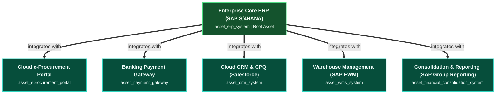

# Architecture Specification: The Core Financial Triad (S2P ⟷ O2C ⟷ R2R)

The **Core Financial Triad** represents the foundational transactional and accounting spine of an enterprise. It unifies procurement expenditure, commercial revenue generation, and general ledger financial reporting into an end-to-end, structurally linked value chain.

```mermaid
flowchart LR
  subgraph S2P ["<b>Source-to-Pay (S2P)</b>"]
    direction TB
    S_PO["s2p_005 Purchase Order"] --> S_GR["s2p_006 Goods Receipt"]
    S_GR --> S_INV["s2p_007 Invoice Match"]
    S_INV --> S_PAY["s2p_008 Payment Disbursement"]
  end

  subgraph O2C ["<b>Order-to-Cash (O2C)</b>"]
    direction TB
    O_ORD["o2c_001 Order Entry"] --> O_CRD["o2c_002 Credit Check"]
    O_CRD --> O_WMS["o2c_003 Fulfillment"]
    O_WMS --> O_BIL["o2c_004 Customer Invoicing"]
    O_BIL --> O_CSH["o2c_005 Cash Reconciliation"]
  end

  subgraph R2R ["<b>Record-to-Report (R2R)</b>"]
    direction TB
    R_GL["r2r_001 GL Journal Ingestion"] --> R_IC["r2r_002 Intercompany Elimination"]
    R_IC --> R_REC["r2r_003 Balance Sheet Substantiation"]
    R_REC --> R_CLS["r2r_004 Close & Consolidation"]
    R_CLS --> R_RPT["r2r_005 Statutory Disclosures"]
  end

  S_PAY ==>|AP Subledger Feed| R_GL
  O_CSH ==>|AR Subledger Feed| R_GL

  classDef s2pBox fill:#0f172a,stroke:#38bdf8,stroke-width:2px,color:#f8fafc;
  classDef o2cBox fill:#1e1b4b,stroke:#a855f7,stroke-width:2px,color:#f3e8ff;
  classDef r2rBox fill:#064e3b,stroke:#34d399,stroke-width:2px,color:#ecfdf5;

  class S_PO,S_GR,S_INV,S_PAY s2pBox;
  class O_ORD,O_CRD,O_WMS,O_BIL,O_CSH o2cBox;
  class R_GL,R_IC,R_REC,R_CLS,R_RPT r2rBox;
```

---

## 1. Architectural Foundations & Principles

1. **Subledger-to-General-Ledger Invariance**: Operational subledgers (Accounts Payable in S2P, Accounts Receivable in O2C) never write directly to final statutory trial balances. All subledger activity posts as debit/credit journal vouchers into General Ledger (`r2r_001_journal_entry_recording`), maintaining complete audit trails.
2. **Double-Entry Balance Constraint**: In accordance with GAAP and IFRS principles, every transaction ingested or generated within the engine must enforce:
   $$\sum \text{Debits} - \sum \text{Credits} = 0$$
3. **Strict Separation of Duties (SoD)**: Operational roles that negotiate contracts, issue purchase orders, or pack warehouse shipments can never authorize payment disbursement or post top-side journal adjustments.
4. **Single Decision Approver (DACI Principle)**: Every milestone step designates exactly one Approver role ($A$) holding unambiguous decision authority to approve or veto.

---

## 2. Cross-Lifecycle Integration Mechanics

### A. Source-to-Pay (S2P) to Record-to-Report (R2R)
- **Feeder Step**: [`s2p_008_payment_settlement_disbursement`](../../elements/process_steps/s2p_008_payment_settlement_disbursement.md)
- **Target Step**: [`r2r_001_journal_entry_recording`](../../elements/process_steps/r2r_001_journal_entry_recording.md)
- **Data Payload**: ISO 20022 Disbursement Clearing Batch (`DISBURSEMENT_REC_v1`)
- **Accounting Posting**:
  - `Debit`: Accounts Payable Liability (`2000-00-AP`)
  - `Credit`: Operating Cash Disbursement Account (`1000-01-CASH`)
- **Governing Policies**:
  - [`sod_spending_limits_policy`](../../elements/control_policies/sod_spending_limits_policy.md)
  - [`sox_financial_reporting_controls_policy`](../../elements/control_policies/sox_financial_reporting_controls_policy.md)

### B. Order-to-Cash (O2C) to Record-to-Report (R2R)
- **Feeder Step**: [`o2c_005_cash_collection_reconciliation`](../../elements/process_steps/o2c_005_cash_collection_reconciliation.md)
- **Target Step**: [`r2r_001_journal_entry_recording`](../../elements/process_steps/r2r_001_journal_entry_recording.md)
- **Data Payload**: BAI2 / CAMT.053 Cash Application Voucher (`CASH_SETTLEMENT_v1`)
- **Accounting Posting**:
  - `Debit`: Operating Cash Concentration Account (`1000-02-CASH`)
  - `Credit`: Accounts Receivable Asset (`1200-00-AR`)
- **Governing Policies**:
  - [`credit_limit_risk_policy`](../../elements/control_policies/credit_limit_risk_policy.md)
  - [`sox_financial_reporting_controls_policy`](../../elements/control_policies/sox_financial_reporting_controls_policy.md)

---

## 3. Level of Detail (LOD) Three-Tier Framework

Every process milestone across the triad adheres to a strict three-tier structure designed for distinct enterprise architecture audiences:

| Tier | Target Stakeholder | Primary Content & Invariants |
| :--- | :--- | :--- |
| **Tier 1** | **Executive / C-Suite** | Capability overview, strategic alignment, corporate outcomes, and business risk profile (fraud, revenue leakage, compliance penalties). |
| **Tier 2** | **Process Architect** | Operational task sequence, RACI execution grid, DACI decision rights, Service Level Agreements (SLAs), and business exception handling. |
| **Tier 3** | **Simulation Engineer** | System asset bindings, queueing math, throughput constraints (TPS), cycle times, unit costs, error rates, automation percentages, and mathematical equations. |

---

## 4. Enterprise IT Asset Topology

The Core Financial Triad operates on an integrated enterprise IT asset landscape anchored by Core ERP:

- **S2P Workloads**: Run on `asset_erp_system`, `asset_eprocurement_portal`, and `asset_payment_gateway`.
- **O2C Workloads**: Run on `asset_crm_system`, `asset_erp_system`, `asset_wms_system`, and `asset_payment_gateway`.
- **R2R Workloads**: Run on `asset_erp_system` (general ledgers) and `asset_financial_consolidation_system` (group eliminations and statutory reporting).

---

## 5. Lifecycle Summary Reference

| Lifecycle ID | Domain | Milestones | Primary Value Stream | Key SLA Target |
| :--- | :--- | :---: | :--- | :--- |
| **S2P** | Procurement & Payables | 8 Steps | [`procure_to_pay_stream`](../../elements/value_streams/procure_to_pay_stream.md) | PO Requisition to Payment < 240 hrs |
| **O2C** | Sales & Cash Application | 5 Steps | [`order_fulfillment_stream`](../../elements/value_streams/order_fulfillment_stream.md) | Order Entry to Cash Clearing < 96 hrs |
| **R2R** | Accounting & Consolidation | 5 Steps | [`financial_close_reporting_stream`](../../elements/value_streams/financial_close_reporting_stream.md) | Period Close to Disclosures < 120 hrs |
