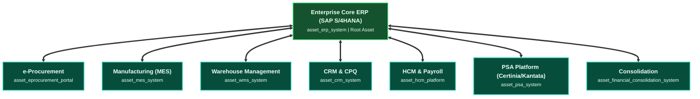

# Architecture Specification: The Enterprise Value Chain

The **Enterprise Value Chain** represents the foundational transactional, operational, and accounting spine of an enterprise. It unifies seven major lifecycles into an end-to-end, structurally linked ecosystem spanning cross-industry back-office, discrete manufacturing, and professional services operating models.

```mermaid
flowchart LR
  subgraph P2M ["<b>Plan-to-Make (P2M)</b>"]
    direction TB
    P_DMD["Demand Sensing"] --> P_MRP["MRP Planning"]
    P_MRP --> P_MFG["Manufacturing"]
    P_MFG --> P_PUT["Finished Goods Put-away"]
  end

  subgraph S2P ["<b>Source-to-Pay (S2P)</b>"]
    direction TB
    S_PO["Purchase Order"] --> S_GR["Goods Receipt"]
    S_GR --> S_INV["Invoice Match"]
    S_INV --> S_PAY["Payment Disbursement"]
  end

  subgraph O2C ["<b>Order-to-Cash (O2C)</b>"]
    direction TB
    O_ORD["Order Entry"] --> O_CRD["Credit Check"]
    O_CRD --> O_WMS["Fulfillment"]
    O_WMS --> O_BIL["Customer Invoicing"]
    O_BIL --> O_CSH["Cash Reconciliation"]
  end

  subgraph H2R ["<b>Hire-to-Retire (H2R)</b>"]
    direction TB
    H_REQ["Job Requisition"] --> H_ONB["Onboarding"]
    H_ONB --> H_PAY["Payroll & Benefits"]
    H_PAY --> H_OFF["Offboarding"]
  end

  subgraph L2C ["<b>Lead-to-Cash (L2C)</b>"]
    direction TB
    L_QUAL["Lead Qualification"] --> L_PROP["Proposal Scoping"]
    L_PROP --> L_CONT["Contract Review"]
    L_CONT --> L_DEAL["Deal Handover"]
  end

  subgraph E2C ["<b>Engagement-to-Cash (E2C)</b>"]
    direction TB
    E_KICK["Project Kickoff"] --> E_STAFF["Resource Scheduling"]
    E_STAFF --> E_DELIV["Milestone Delivery"]
    E_DELIV --> E_TIME["Time & Expense"]
    E_TIME --> E_ACPT["Client Acceptance"]
    E_ACPT --> E_BILL["Project Billing"]
    E_BILL --> E_CLS["Project Closure"]
  end

  subgraph R2R ["<b>Record-to-Report (R2R)</b>"]
    direction TB
    R_GL["GL Journal Ingestion"] --> R_IC["Intercompany Elimination"]
    R_IC --> R_REC["Balance Sheet Substantiation"]
    R_REC --> R_CLS["Close & Consolidation"]
    R_CLS --> R_RPT["Statutory Disclosures"]
  end

  S_GR -.->|Raw Materials| P_MFG
  P_PUT -.->|Available to Promise (ATP)| O_WMS
  L_DEAL -.->|Engagement Handover| E_KICK
  S_PAY ==>|AP Subledger Feed| R_GL
  O_CSH ==>|AR Subledger Feed| R_GL
  H_PAY ==>|Payroll Expense Feed| R_GL
  H_OFF ==>|Severance Feed| R_GL
  E_BILL ==>|Services Invoicing Feed| R_GL

  classDef p2mBox fill:#312e81,stroke:#6366f1,stroke-width:2px,color:#e0e7ff;
  classDef s2pBox fill:#0f172a,stroke:#38bdf8,stroke-width:2px,color:#f8fafc;
  classDef o2cBox fill:#1e1b4b,stroke:#a855f7,stroke-width:2px,color:#f3e8ff;
  classDef h2rBox fill:#4c1d95,stroke:#8b5cf6,stroke-width:2px,color:#ede9fe;
  classDef r2rBox fill:#064e3b,stroke:#34d399,stroke-width:2px,color:#ecfdf5;
  classDef psBox fill:#451a03,stroke:#fbbf24,stroke-width:2px,color:#fef3c7;

  class P_DMD,P_MRP,P_MFG,P_PUT p2mBox;
  class S_PO,S_GR,S_INV,S_PAY s2pBox;
  class O_ORD,O_CRD,O_WMS,O_BIL,O_CSH o2cBox;
  class H_REQ,H_ONB,H_PAY,H_OFF h2rBox;
  class R_GL,R_IC,R_REC,R_CLS,R_RPT r2rBox;
  class L_QUAL,L_PROP,L_CONT,L_DEAL,E_KICK,E_STAFF,E_DELIV,E_TIME,E_ACPT,E_BILL,E_CLS psBox;
```

---

## 1. Architectural Foundations & Principles

1. **Subledger-to-General-Ledger Invariance**: Operational subledgers (Accounts Payable in S2P, Accounts Receivable in O2C, Payroll in H2R, Consulting Billing in E2C) never write directly to final statutory trial balances. All subledger activity posts as debit/credit journal vouchers into General Ledger (`r2r_001_journal_entry_recording`), maintaining complete audit trails.
2. **Double-Entry Balance Constraint**: In accordance with GAAP and IFRS principles, every transaction ingested or generated within the engine must enforce:
   $$\sum \text{Debits} - \sum \text{Credits} = 0$$
3. **Strict Separation of Duties (SoD)**: The Accountable (A) and Responsible (R) roles on a single process step cannot be the same entity unless an explicit `compensating_control` is mathematically documented in the node's frontmatter.
4. **Capacity & Flow Physics**: Material and human queues (S2P $\rightarrow$ P2M $\rightarrow$ O2C and L2C $\rightarrow$ E2C) are subject to capacity constraints modeled via `volume_per_period` and `capacity_fte`. 

---

## 2. Cross-Lifecycle Integration Mechanics

### A. Operational Flow (S2P $\rightarrow$ P2M $\rightarrow$ O2C & L2C $\rightarrow$ E2C)
- **Discrete Manufacturing**: Raw materials are procured through **S2P** and physically received at `s2p_006_goods_services_receipt`. These materials are fed into **P2M** (`p2m_004_manufacturing_execution`), transformed into finished goods, and put away in `p2m_006_finished_goods_putaway`. This updates the Available-to-Promise (ATP) inventory ledger, allowing **O2C** (`o2c_003_inventory_allocation_fulfillment`) to ship products against customer orders.
- **Professional Services**: Commercial opportunities are scoped and contracted in **L2C** (`l2c_001` through `l2c_004`), producing the Statement of Work (`data_statement_of_work`), which triggers project delivery initiation in **E2C** (`e2c_001_project_kickoff`).

### B. Financial Ingestion (Subledgers $\rightarrow$ R2R)
All external lifecycles act as subledger feeders into **R2R** (`r2r_001_journal_entry_recording`):
- **S2P (`s2p_008`)**: Accounts Payable liability and cash disbursements.
- **O2C (`o2c_004`, `o2c_005`)**: Accounts Receivable assets and cash concentration.
- **H2R (`h2r_004`, `h2r_006`)**: Payroll expenses, tax liabilities, and offboarding settlements.
- **E2C (`e2c_006`)**: Professional services client invoices, time & expense billables, and milestone revenue recognition feeds.

---

## 3. Level of Detail (LOD) Three-Tier Framework

Every process milestone across the enterprise adheres to a strict three-tier structure designed for distinct enterprise architecture audiences:

| Tier | Target Stakeholder | Primary Content & Invariants |
| :--- | :--- | :--- |
| **Tier 1** | **Executive / C-Suite** | Capability overview, strategic alignment, corporate outcomes, and business risk profile (fraud, revenue leakage, compliance penalties). |
| **Tier 2** | **Process Architect** | Operational task sequence, RACI execution grid, DACI decision rights, SLAs, business rules, and non-linear exception branching. |
| **Tier 3** | **Simulation Engineer** | System asset bindings, queueing math, throughput constraints (TPS), cycle times, unit costs, error rates, capacity FTE modeling. |

---

## 4. Enterprise IT Asset Topology

The Enterprise operates on an integrated IT asset landscape anchored by Core ERP:



---

## 5. Lifecycle Summary Reference

| Lifecycle ID | Domain | Milestones | Primary Focus | Key Integrations |
| :--- | :--- | :---: | :--- | :--- |
| **S2P** | Procurement & Finance | 8 Steps | RFx, PO Issuance, 3-Way Match, AP Settlement | Feeds P2M materials, Feeds R2R AP Subledger |
| **O2C** | Sales & Commercial Ops | 5 Steps | Credit Check, Allocation, Fulfillment, Billing | Consumes P2M ATP, Feeds R2R AR Subledger |
| **R2R** | Accounting & GL | 5 Steps | Journal Ingestion, Intercompany, Close, Consolidation | Root financial ledger for all enterprise subledgers |
| **H2R** | Human Capital | 6 Steps | Requisition, Onboarding, Payroll, Offboarding | Feeds R2R Payroll Expense and Liabilities |
| **P2M** | Supply Chain & Mfg | 6 Steps | Demand Forecasting, MRP, Shop Execution, Put-away | Ingests from S2P, Feeds O2C ATP Inventory |
| **L2C** | Prof. Services Sales | 4 Steps | Lead Discovery, Scoping, MSA/SOW Negotiation | Produces SOW, Feeds E2C Kickoff Handover |
| **E2C** | Prof. Services Delivery | 7 Steps | PSA Scheduling, Delivery, Timesheets, Billing | Feeds R2R AR Subledger and Revenue Recognition |
