# Architecture Specification: RACI & DACI Dual-Governance Models

Modern enterprise value chains require clear separation between **operational execution** (who does the work) and **decision authority** (who decides and signs off). The engine natively supports and enforces both the **RACI** and **DACI** models across all business lifecycles.

---

## 1. Dual Governance Overview: RACI vs. DACI

```mermaid
flowchart TD
  subgraph RACI ["<b>Operational Execution (RACI)</b>"]
    direction TB
    R["<b>R - Responsible</b><br/>Executes tasks & generates deliverables"]
    A_R["<b>A - Accountable</b><br/>Ensures operational completion"]
    C["<b>C - Consulted</b><br/>Provides inputs, reviews & SME advice"]
    I_R["<b>I - Informed</b><br/>Notified upon task completion"]
  end

  subgraph DACI ["<b>Decision Authority (DACI)</b>"]
    direction TB
    D["<b>D - Driver</b><br/>Orchestrates discussion & recommendation"]
    A_D["<b>A - Approver</b><br/>Single veto / sign-off decision authority"]
    K["<b>C - Contributor</b><br/>Submits evidence, data & analysis"]
    I_D["<b>I - Informed</b><br/>Notified of decision outcome"]
  end

  classDef raciStyle fill:#0f172a,stroke:#38bdf8,stroke-width:2px,color:#f8fafc;
  classDef daciStyle fill:#1e1b4b,stroke:#a855f7,stroke-width:2px,color:#f3e8ff;

  class R,A_R,C,I_R raciStyle;
  class D,A_D,K,I_D daciStyle;
```

### Side-by-Side Comparison

| Dimension | RACI (Operational Delivery) | DACI (Decision Authority) |
| :--- | :--- | :--- |
| **Primary Question** | *"Who executes this process milestone?"* | *"Who possesses the authority to decide this?"* |
| **Primary Role (Lead)** | **Responsible (R)**: Executes workflows, operates system tools, and compiles deliverables. | **Driver (D)**: Facilitates alignment, drafts proposal, gathers evidence, and drives momentum. |
| **Authority Role** | **Accountable (A)**: Ultimately accountable for task completion. | **Approver (A)**: Holds sole decision authority to approve or veto the milestone. |
| **Advisory Roles** | **Consulted (C)**: Two-way operational communication. | **Contributor (C)**: Submits analytical data, risks, and viewpoints. |
| **Notification Roles** | **Informed (I)**: One-way milestone update. | **Informed (I)**: Notified once decision is signed off. |
| **Key Invariant** | **Segregation of Duties (SoD)**: $R \cap A = \emptyset$ (preferred for financial controls). | **Single Approver Rule**: $|A| = 1$ (strictly enforced). |

---

## 2. The Single Approver Rule (DACI)

A common failure mode in corporate organizations is **consensus paralysis**, where decisions are delayed due to ambiguous approval authority or diffuse committee ownership.

### Mathematical Formulation
For every process step $e \in E_{\text{process\_step}}$:
$$| \text{DACI}_{\text{approver}}(e) | = 1$$

If $|\text{DACI}_{\text{approver}}(e)| > 1$, the model compiler flags a **Split Approver Authority Defect** in [`index/diagram_daci_matrix.md`](../../index/diagram_daci_matrix.md).

### Resolution Pattern
When multiple stakeholders must provide input prior to approval:
1. Designate the primary accountable business owner as the sole **Approver ($A$)**.
2. Transition secondary stakeholders to **Contributors ($C$)**.
3. Require documented evidence of Contributor sign-off prior to Approver authorization.

---

## 3. Segregation of Duties (SoD) Conflict Analysis (RACI)

Segregation of Duties (SoD) is an essential internal control mandated by Sarbanes-Oxley (SOX 404), ISO 27001, and international financial regulations. It ensures that no single individual or enterprise role holds unchecked authority to execute and authorize transactions.

### Conflict Detection Algorithm
The build engine inspects all active elements and evaluates:
$$\text{Conflict}(e) = \text{RACI}_{\text{responsible}}(e) \cap \text{RACI}_{\text{accountable}}(e)$$

$$\text{SoD Violation} \iff \text{Conflict}(e) \neq \emptyset$$

### High-Risk Toxic Combinations

| Conflict Archetype | Responsible Role | Accountable Role | Risk Profile & Threat |
| :--- | :--- | :--- | :--- |
| **Disbursement Fraud** | AP Clerk (`role_accounts_payable_clerk`) | AP Clerk (`role_accounts_payable_clerk`) | Unauthorized vendor wire disbursements without supervisory check. |
| **Sourcing Collusion** | Buyer (`role_procurement_specialist`) | Buyer (`role_procurement_specialist`) | Single-bidder vendor awards without category manager sign-off. |
| **Ledger Manipulation** | GL Accountant (`role_general_ledger_accountant`) | GL Accountant (`role_general_ledger_accountant`) | Fictitious manual journal entries posted without Controller review. |
| **Credit Bypass** | Sales Ops (`role_sales_ops_specialist`) | Sales Ops (`role_sales_ops_specialist`) | Override of credit limits on insolvent customer accounts to meet sales quotas. |

### Compensating Control Framework
In operational steps where departmental staffing constraints result in execution/sign-off overlaps (e.g., initial quote entry or warehouse wave release):
1. **Automated System Safeguards**: Hardcoded validation rules in `asset_erp_system` preventing execution outside prescribed limits.
2. **Post-Execution Independent Audit**: Quarterly sampling by `role_internal_auditor` to detect anomalous transaction patterns.

---

## 4. Role Workload & Governance Weighting

The validator aggregates role participation counts across all enterprise lifecycles to calculate operational workload and governance weight:

$$\text{Workload}(r) = \sum_{e \in E} \left( R(r, e) + A(r, e) + C(r, e) + I(r, e) \right)$$

### Governance Classification Tiers

- **Strategic Approver ($\ge 3$ Approvals)**: E.g., `role_finance_controller`, `role_category_manager`. Critical enterprise sign-off bottleneck.
- **Primary Driver ($\ge 3$ Driver Roles)**: E.g., `role_procurement_specialist`, `role_consolidation_specialist`. High operational execution load.
- **Operational Authority ($1-2$ Approvals / Drivers)**: E.g., `role_credit_manager`, `role_general_ledger_accountant`.
- **Advisory (Consulted / Informed only)**: E.g., `role_internal_auditor`, `role_supplier`.

Detailed metrics and real-time workload heatmaps are auto-compiled into [`index/diagram_raci_matrix.md`](../../index/diagram_raci_matrix.md) and [`index/diagram_daci_matrix.md`](../../index/diagram_daci_matrix.md).
