# Enterprise Value Chain Diagrams Summary [ALL]

Auto-generated visualization pack compiled from validated knowledge graph index.

---

## 1. End-to-End Value Chain Process Flowchart

```mermaid
flowchart TD
  %% Style Classes
  classDef processStep fill:#0f172a,stroke:#38bdf8,stroke-width:2px,color:#f8fafc,rx:8,ry:8;
  classDef controlPolicy fill:#1e1b4b,stroke:#a855f7,stroke-width:2px,stroke-dasharray: 4 4,color:#f3e8ff,rx:4,ry:4;
  classDef valueStream fill:#064e3b,stroke:#34d399,stroke-width:2px,color:#ecfdf5,rx:12,ry:12;

  subgraph Subgraph_ValueStreams ["<b>Enterprise Value Streams</b>"]
    financial_close_reporting_stream[["<b>Stream: Financial Close, Consolidation &amp; Regulatory Reporting Stream</b><br/><small>financial_close_reporting_stream</small>"]]:::valueStream
    order_fulfillment_stream[["<b>Stream: Order-to-Fulfillment &amp; Cash Revenue Stream</b><br/><small>order_fulfillment_stream</small>"]]:::valueStream
    procure_to_pay_stream[["<b>Stream: Procure to Pay (P2P) Operational Value Stream</b><br/><small>procure_to_pay_stream</small>"]]:::valueStream
    strategic_sourcing_stream[["<b>Stream: Strategic Sourcing &amp; Contracting Value Stream</b><br/><small>strategic_sourcing_stream</small>"]]:::valueStream
  end

  subgraph Subgraph_Sourcing ["<b>Strategic Sourcing & Contracting Phase</b>"]
    s2p_001_spend_analysis_need_id["<b>Spend Analysis &amp; Need Identification</b><br/><small>ID: s2p_001_spend_analysis_need_id</small><br/>⏱ 12.0h | 💰 $45.0 | ⚡ 70% auto"]:::processStep
    s2p_002_supplier_discovery_qualification["<b>Supplier Discovery &amp; Qualification</b><br/><small>ID: s2p_002_supplier_discovery_qualification</small><br/>⏱ 48.0h | 💰 $120.0 | ⚡ 50% auto"]:::processStep
    s2p_003_sourcing_rfx_auction["<b>Strategic Sourcing &amp; RFx Execution</b><br/><small>ID: s2p_003_sourcing_rfx_auction</small><br/>⏱ 96.0h | 💰 $250.0 | ⚡ 65% auto"]:::processStep
    s2p_004_contracting_sla_negotiation["<b>Contracting &amp; SLA Negotiation</b><br/><small>ID: s2p_004_contracting_sla_negotiation</small><br/>⏱ 72.0h | 💰 $300.0 | ⚡ 40% auto"]:::processStep
  end

  subgraph Subgraph_P2P ["<b>Procure-to-Pay (P2P) Operational Phase</b>"]
    s2p_005_purchase_requisition_po["<b>Purchase Requisition &amp; PO Issuance</b><br/><small>ID: s2p_005_purchase_requisition_po</small><br/>⏱ 8.0h | 💰 $18.0 | ⚡ 90% auto"]:::processStep
    s2p_006_goods_services_receipt["<b>Goods &amp; Services Receipt Verification</b><br/><small>ID: s2p_006_goods_services_receipt</small><br/>⏱ 6.0h | 💰 $12.5 | ⚡ 80% auto"]:::processStep
    s2p_007_invoice_verification_matching["<b>Invoice 3-Way Matching &amp; Exception Handling</b><br/><small>ID: s2p_007_invoice_verification_matching</small><br/>⏱ 16.0h | 💰 $22.0 | ⚡ 75% auto"]:::processStep
    s2p_008_payment_settlement_disbursement["<b>Payment Settlement &amp; Disbursement</b><br/><small>ID: s2p_008_payment_settlement_disbursement</small><br/>⏱ 4.0h | 💰 $8.5 | ⚡ 95% auto"]:::processStep
  end

  subgraph Subgraph_O2C ["<b>Order-to-Cash Commercial & Fulfillment Phase</b>"]
    o2c_001_customer_quote_order_entry["<b>Quote Generation &amp; Order Capture</b><br/><small>ID: o2c_001_customer_quote_order_entry</small><br/>⏱ 6.0h | 💰 $25.0 | ⚡ 80% auto"]:::processStep
    o2c_002_credit_check_approval["<b>Customer Credit Assessment &amp; Exposure Check</b><br/><small>ID: o2c_002_credit_check_approval</small><br/>⏱ 4.0h | 💰 $15.0 | ⚡ 90% auto"]:::processStep
    o2c_003_inventory_allocation_fulfillment["<b>Inventory Allocation &amp; Warehouse Fulfillment</b><br/><small>ID: o2c_003_inventory_allocation_fulfillment</small><br/>⏱ 24.0h | 💰 $65.0 | ⚡ 65% auto"]:::processStep
    o2c_004_billing_invoice_generation["<b>Customer Billing &amp; Electronic Invoicing</b><br/><small>ID: o2c_004_billing_invoice_generation</small><br/>⏱ 2.0h | 💰 $6.5 | ⚡ 95% auto"]:::processStep
    o2c_005_cash_collection_reconciliation["<b>Cash Collection &amp; Accounts Receivable Reconciliation</b><br/><small>ID: o2c_005_cash_collection_reconciliation</small><br/>⏱ 8.0h | 💰 $12.0 | ⚡ 85% auto"]:::processStep
  end

  subgraph Subgraph_R2R ["<b>Record-to-Report Financial Accounting Phase</b>"]
    r2r_001_journal_entry_recording["<b>General Ledger Journal Recording &amp; Subledger Ingestion</b><br/><small>ID: r2r_001_journal_entry_recording</small><br/>⏱ 8.0h | 💰 $18.0 | ⚡ 82% auto"]:::processStep
    r2r_002_intercompany_reconciliation["<b>Intercompany Transaction Matching &amp; Elimination</b><br/><small>ID: r2r_002_intercompany_reconciliation</small><br/>⏱ 12.0h | 💰 $35.0 | ⚡ 75% auto"]:::processStep
    r2r_003_balance_sheet_substantiation["<b>Balance Sheet Account Substantiation &amp; Reconciliation</b><br/><small>ID: r2r_003_balance_sheet_substantiation</small><br/>⏱ 16.0h | 💰 $45.0 | ⚡ 70% auto"]:::processStep
    r2r_004_financial_close_consolidation["<b>Financial Close Orchestration &amp; Group Consolidation</b><br/><small>ID: r2r_004_financial_close_consolidation</small><br/>⏱ 20.0h | 💰 $65.0 | ⚡ 80% auto"]:::processStep
    r2r_005_statutory_financial_reporting["<b>Statutory, Tax &amp; Management Financial Reporting</b><br/><small>ID: r2r_005_statutory_financial_reporting</small><br/>⏱ 14.0h | 💰 $50.0 | ⚡ 65% auto"]:::processStep
  end

  subgraph Subgraph_Other ["<b>Process Steps</b>"]
    h2r_001_job_requisition_posting["<b>Job Requisition Definition &amp; Posting</b><br/><small>ID: h2r_001_job_requisition_posting</small><br/>⏱ 48.0h | 💰 $120.0"]:::processStep
    p2m_001_demand_sensing_forecasting["<b>Statistical Demand Sensing &amp; Forecasting</b><br/><small>ID: p2m_001_demand_sensing_forecasting</small><br/>⏱ 168.0h | 💰 $50.0"]:::processStep
    h2r_002_candidate_screening_interview["<b>Candidate Screening &amp; Interview Execution</b><br/><small>ID: h2r_002_candidate_screening_interview</small><br/>⏱ 168.0h | 💰 $800.0"]:::processStep
    p2m_002_mrp_production_planning["<b>Material Requirements Planning (MRP)</b><br/><small>ID: p2m_002_mrp_production_planning</small><br/>⏱ 24.0h | 💰 $15.0"]:::processStep
    h2r_003_offer_letter_onboarding["<b>Offer Letter Generation &amp; Employee Onboarding</b><br/><small>ID: h2r_003_offer_letter_onboarding</small><br/>⏱ 48.0h | 💰 $150.0"]:::processStep
    p2m_003_production_order_release["<b>Production Order Sequencing &amp; Release</b><br/><small>ID: p2m_003_production_order_release</small><br/>⏱ 8.0h | 💰 $10.0"]:::processStep
    h2r_004_payroll_benefits_enrollment["<b>Payroll &amp; Benefits Enrollment Processing</b><br/><small>ID: h2r_004_payroll_benefits_enrollment</small><br/>⏱ 24.0h | 💰 $45.0"]:::processStep
    p2m_004_manufacturing_execution["<b>Manufacturing Execution &amp; Yield Tracking</b><br/><small>ID: p2m_004_manufacturing_execution</small><br/>⏱ 48.0h | 💰 $1500.0"]:::processStep
    h2r_005_performance_compensation_review["<b>Performance &amp; Compensation Review</b><br/><small>ID: h2r_005_performance_compensation_review</small><br/>⏱ 120.0h | 💰 $200.0"]:::processStep
    p2m_005_quality_inspection_release["<b>Quality Inspection &amp; Batch Release</b><br/><small>ID: p2m_005_quality_inspection_release</small><br/>⏱ 24.0h | 💰 $50.0"]:::processStep
    h2r_006_separation_offboarding_settlement["<b>Separation, Offboarding &amp; Final Settlement</b><br/><small>ID: h2r_006_separation_offboarding_settlement</small><br/>⏱ 48.0h | 💰 $300.0"]:::processStep
    p2m_006_finished_goods_putaway["<b>Finished Goods Put-Away &amp; ATP Update</b><br/><small>ID: p2m_006_finished_goods_putaway</small><br/>⏱ 4.0h | 💰 $10.0"]:::processStep
    test_invalid_schema["<b>Test Invalid Schema</b><br/><small>ID: test_invalid_schema</small><br/>⏱ 0.0h | 💰 $0.0"]:::processStep
  end

  subgraph Subgraph_Governance ["<b>Governance & Control Policies</b>"]
    credit_limit_risk_policy(["<b>Policy: Commercial Credit Limit &amp; Customer Risk Exposure Policy</b><br/><small>credit_limit_risk_policy</small>"]):::controlPolicy
    sod_spending_limits_policy(["<b>Policy: Segregation of Duties &amp; Financial Authority Policy</b><br/><small>sod_spending_limits_policy</small>"]):::controlPolicy
    sox_financial_reporting_controls_policy(["<b>Policy: SOX 404 Financial Reporting Internal Controls &amp; Materiality Thresholds Policy</b><br/><small>sox_financial_reporting_controls_policy</small>"]):::controlPolicy
  end

  %% Process Flows & Policy Linkages
  s2p_008_payment_settlement_disbursement --> r2r_001_journal_entry_recording
  s2p_008_payment_settlement_disbursement -. governed by .-> sod_spending_limits_policy
  s2p_001_spend_analysis_need_id --> s2p_002_supplier_discovery_qualification
  s2p_001_spend_analysis_need_id -. governed by .-> sod_spending_limits_policy
  p2m_001_demand_sensing_forecasting --> p2m_002_mrp_production_planning
  p2m_005_quality_inspection_release --> p2m_006_finished_goods_putaway
  p2m_005_quality_inspection_release -. exception_to .-> p2m_004_manufacturing_execution
  s2p_005_purchase_requisition_po --> s2p_006_goods_services_receipt
  s2p_005_purchase_requisition_po -. governed by .-> sod_spending_limits_policy
  o2c_001_customer_quote_order_entry --> o2c_002_credit_check_approval
  o2c_001_customer_quote_order_entry -. governed by .-> credit_limit_risk_policy
  r2r_003_balance_sheet_substantiation --> r2r_004_financial_close_consolidation
  r2r_003_balance_sheet_substantiation -. governed by .-> sox_financial_reporting_controls_policy
  r2r_001_journal_entry_recording --> r2r_002_intercompany_reconciliation
  r2r_001_journal_entry_recording -. governed by .-> sox_financial_reporting_controls_policy
  r2r_001_journal_entry_recording -. produces_artifact .-> data_journal_entry
  s2p_004_contracting_sla_negotiation --> s2p_005_purchase_requisition_po
  s2p_004_contracting_sla_negotiation -. governed by .-> sod_spending_limits_policy
  h2r_005_performance_compensation_review --> h2r_006_separation_offboarding_settlement
  p2m_002_mrp_production_planning --> p2m_003_production_order_release
  p2m_002_mrp_production_planning -. triggers .-> s2p_001_spend_analysis_need_id
  h2r_006_separation_offboarding_settlement --> r2r_001_journal_entry_recording
  o2c_005_cash_collection_reconciliation --> r2r_001_journal_entry_recording
  o2c_005_cash_collection_reconciliation -. governed by .-> sod_spending_limits_policy
  h2r_003_offer_letter_onboarding --> h2r_004_payroll_benefits_enrollment
  h2r_003_offer_letter_onboarding -. exception_to .-> h2r_002_candidate_screening_interview
  r2r_005_statutory_financial_reporting -. governed by .-> sox_financial_reporting_controls_policy
  s2p_002_supplier_discovery_qualification --> s2p_003_sourcing_rfx_auction
  s2p_002_supplier_discovery_qualification -. governed by .-> sod_spending_limits_policy
  r2r_004_financial_close_consolidation --> r2r_005_statutory_financial_reporting
  r2r_004_financial_close_consolidation -. governed by .-> sox_financial_reporting_controls_policy
  s2p_003_sourcing_rfx_auction --> s2p_004_contracting_sla_negotiation
  h2r_001_job_requisition_posting --> h2r_002_candidate_screening_interview
  p2m_004_manufacturing_execution --> p2m_005_quality_inspection_release
  p2m_004_manufacturing_execution -. impacted_by .-> s2p_006_goods_services_receipt
  p2m_003_production_order_release --> p2m_004_manufacturing_execution
  s2p_007_invoice_verification_matching --> s2p_008_payment_settlement_disbursement
  s2p_007_invoice_verification_matching -. exception_to .-> s2p_006_goods_services_receipt
  s2p_007_invoice_verification_matching -. governed by .-> sod_spending_limits_policy
  o2c_003_inventory_allocation_fulfillment --> o2c_004_billing_invoice_generation
  p2m_006_finished_goods_putaway --> o2c_003_inventory_allocation_fulfillment
  h2r_004_payroll_benefits_enrollment --> h2r_005_performance_compensation_review
  h2r_004_payroll_benefits_enrollment --> r2r_001_journal_entry_recording
  h2r_002_candidate_screening_interview --> h2r_003_offer_letter_onboarding
  h2r_002_candidate_screening_interview -. exception_to .-> h2r_001_job_requisition_posting
  r2r_002_intercompany_reconciliation --> r2r_003_balance_sheet_substantiation
  r2r_002_intercompany_reconciliation -. governed by .-> sox_financial_reporting_controls_policy
  s2p_006_goods_services_receipt --> s2p_007_invoice_verification_matching
  s2p_006_goods_services_receipt --> p2m_004_manufacturing_execution
  o2c_002_credit_check_approval --> o2c_003_inventory_allocation_fulfillment
  o2c_002_credit_check_approval -. governed by .-> credit_limit_risk_policy
  o2c_004_billing_invoice_generation --> o2c_005_cash_collection_reconciliation
  o2c_004_billing_invoice_generation -. governed by .-> sod_spending_limits_policy
  financial_close_reporting_stream -. governed by .-> sox_financial_reporting_controls_policy
  strategic_sourcing_stream --> procure_to_pay_stream
  procure_to_pay_stream -. governed by .-> sod_spending_limits_policy
  order_fulfillment_stream -. governed by .-> credit_limit_risk_policy
  order_fulfillment_stream -. governed by .-> sod_spending_limits_policy
  kpi_dso -. impacted_by .-> o2c_005_cash_collection_reconciliation
  data_journal_entry -. triggers .-> r2r_002_intercompany_reconciliation
```

---

## 2. RACI Role Handoff & Swimlane Sequence

```mermaid
flowchart LR
  %% RACI Swimlanes Styling
  classDef roleLane fill:#0f172a,stroke:#64748b,stroke-width:1px,color:#cbd5e1;
  classDef rNode fill:#1e3a8a,stroke:#60a5fa,stroke-width:2px,color:#eff6ff,rx:6,ry:6;
  classDef aNode fill:#701a75,stroke:#f472b6,stroke-width:2px,color:#fdf2f8,rx:6,ry:6;

  subgraph Sub_role_manufacturing_supervisor ["<b>Manufacturing Supervisor</b>"]
    p2m_004_manufacturing_execution__R["<b>Manufacturing Execution &amp; Yield Tracking</b><br/>Role: <b>Responsible (R)</b>"]:::rNode
    p2m_003_production_order_release__A["<b>Production Order Sequencing &amp; Release</b><br/>Role: <b>Accountable (A)</b>"]:::aNode
    p2m_004_manufacturing_execution__A["<b>Manufacturing Execution &amp; Yield Tracking</b><br/>Role: <b>Accountable (A)</b>"]:::aNode
  end

  subgraph Sub_role_hr_business_partner ["<b>HR Business Partner (HRBP)</b>"]
    h2r_006_separation_offboarding_settlement__R["<b>Separation, Offboarding &amp; Final Settlement</b><br/>Role: <b>Responsible (R)</b>"]:::rNode
    h2r_006_separation_offboarding_settlement__A["<b>Separation, Offboarding &amp; Final Settlement</b><br/>Role: <b>Accountable (A)</b>"]:::aNode
  end

  subgraph Sub_role_warehouse_supervisor ["<b>Warehouse &amp; Fulfillment Supervisor</b>"]
    o2c_003_inventory_allocation_fulfillment__R["<b>Inventory Allocation &amp; Warehouse Fulfillment</b><br/>Role: <b>Responsible (R)</b>"]:::rNode
    o2c_003_inventory_allocation_fulfillment__A["<b>Inventory Allocation &amp; Warehouse Fulfillment</b><br/>Role: <b>Accountable (A)</b>"]:::aNode
  end

  subgraph Sub_role_talent_acquisition_specialist ["<b>Talent Acquisition Specialist</b>"]
    h2r_002_candidate_screening_interview__R["<b>Candidate Screening &amp; Interview Execution</b><br/>Role: <b>Responsible (R)</b>"]:::rNode
    h2r_003_offer_letter_onboarding__R["<b>Offer Letter Generation &amp; Employee Onboarding</b><br/>Role: <b>Responsible (R)</b>"]:::rNode
  end

  subgraph Sub_role_sales_ops_specialist ["<b>Sales Operations Specialist</b>"]
    o2c_001_customer_quote_order_entry__R["<b>Quote Generation &amp; Order Capture</b><br/>Role: <b>Responsible (R)</b>"]:::rNode
    o2c_001_customer_quote_order_entry__A["<b>Quote Generation &amp; Order Capture</b><br/>Role: <b>Accountable (A)</b>"]:::aNode
  end

  subgraph Sub_role_inventory_manager ["<b>Inventory Manager</b>"]
    p2m_006_finished_goods_putaway__R["<b>Finished Goods Put-Away &amp; ATP Update</b><br/>Role: <b>Responsible (R)</b>"]:::rNode
    p2m_006_finished_goods_putaway__A["<b>Finished Goods Put-Away &amp; ATP Update</b><br/>Role: <b>Accountable (A)</b>"]:::aNode
  end

  subgraph Sub_role_demand_planner ["<b>Demand Planner</b>"]
    p2m_001_demand_sensing_forecasting__R["<b>Statistical Demand Sensing &amp; Forecasting</b><br/>Role: <b>Responsible (R)</b>"]:::rNode
    p2m_001_demand_sensing_forecasting__A["<b>Statistical Demand Sensing &amp; Forecasting</b><br/>Role: <b>Accountable (A)</b>"]:::aNode
  end

  subgraph Sub_role_billing_specialist ["<b>Billing &amp; Accounts Receivable Specialist</b>"]
    o2c_004_billing_invoice_generation__R["<b>Customer Billing &amp; Electronic Invoicing</b><br/>Role: <b>Responsible (R)</b>"]:::rNode
    o2c_005_cash_collection_reconciliation__R["<b>Cash Collection &amp; Accounts Receivable Reconciliation</b><br/>Role: <b>Responsible (R)</b>"]:::rNode
  end

  subgraph Sub_role_production_scheduler ["<b>Production Scheduler</b>"]
    p2m_002_mrp_production_planning__R["<b>Material Requirements Planning (MRP)</b><br/>Role: <b>Responsible (R)</b>"]:::rNode
    p2m_003_production_order_release__R["<b>Production Order Sequencing &amp; Release</b><br/>Role: <b>Responsible (R)</b>"]:::rNode
    p2m_002_mrp_production_planning__A["<b>Material Requirements Planning (MRP)</b><br/>Role: <b>Accountable (A)</b>"]:::aNode
  end

  subgraph Sub_role_finance_controller ["<b>Finance Controller</b>"]
    r2r_001_journal_entry_recording__A["<b>General Ledger Journal Recording &amp; Subledger Ingestion</b><br/>Role: <b>Accountable (A)</b>"]:::aNode
    o2c_002_credit_check_approval__A["<b>Customer Credit Assessment &amp; Exposure Check</b><br/>Role: <b>Accountable (A)</b>"]:::aNode
    r2r_002_intercompany_reconciliation__A["<b>Intercompany Transaction Matching &amp; Elimination</b><br/>Role: <b>Accountable (A)</b>"]:::aNode
    r2r_003_balance_sheet_substantiation__A["<b>Balance Sheet Account Substantiation &amp; Reconciliation</b><br/>Role: <b>Accountable (A)</b>"]:::aNode
    o2c_004_billing_invoice_generation__A["<b>Customer Billing &amp; Electronic Invoicing</b><br/>Role: <b>Accountable (A)</b>"]:::aNode
    r2r_004_financial_close_consolidation__A["<b>Financial Close Orchestration &amp; Group Consolidation</b><br/>Role: <b>Accountable (A)</b>"]:::aNode
    o2c_005_cash_collection_reconciliation__A["<b>Cash Collection &amp; Accounts Receivable Reconciliation</b><br/>Role: <b>Accountable (A)</b>"]:::aNode
    r2r_005_statutory_financial_reporting__A["<b>Statutory, Tax &amp; Management Financial Reporting</b><br/>Role: <b>Accountable (A)</b>"]:::aNode
    s2p_007_invoice_verification_matching__A["<b>Invoice 3-Way Matching &amp; Exception Handling</b><br/>Role: <b>Accountable (A)</b>"]:::aNode
    s2p_008_payment_settlement_disbursement__A["<b>Payment Settlement &amp; Disbursement</b><br/>Role: <b>Accountable (A)</b>"]:::aNode
  end

  subgraph Sub_role_category_manager ["<b>Category Manager</b>"]
    s2p_004_contracting_sla_negotiation__R["<b>Contracting &amp; SLA Negotiation</b><br/>Role: <b>Responsible (R)</b>"]:::rNode
    s2p_001_spend_analysis_need_id__A["<b>Spend Analysis &amp; Need Identification</b><br/>Role: <b>Accountable (A)</b>"]:::aNode
    s2p_002_supplier_discovery_qualification__A["<b>Supplier Discovery &amp; Qualification</b><br/>Role: <b>Accountable (A)</b>"]:::aNode
    s2p_003_sourcing_rfx_auction__A["<b>Strategic Sourcing &amp; RFx Execution</b><br/>Role: <b>Accountable (A)</b>"]:::aNode
    s2p_004_contracting_sla_negotiation__A["<b>Contracting &amp; SLA Negotiation</b><br/>Role: <b>Accountable (A)</b>"]:::aNode
    s2p_005_purchase_requisition_po__A["<b>Purchase Requisition &amp; PO Issuance</b><br/>Role: <b>Accountable (A)</b>"]:::aNode
    s2p_006_goods_services_receipt__A["<b>Goods &amp; Services Receipt Verification</b><br/>Role: <b>Accountable (A)</b>"]:::aNode
  end

  subgraph Sub_role_general_ledger_accountant ["<b>General Ledger Accountant</b>"]
    r2r_001_journal_entry_recording__R["<b>General Ledger Journal Recording &amp; Subledger Ingestion</b><br/>Role: <b>Responsible (R)</b>"]:::rNode
    r2r_003_balance_sheet_substantiation__R["<b>Balance Sheet Account Substantiation &amp; Reconciliation</b><br/>Role: <b>Responsible (R)</b>"]:::rNode
  end

  subgraph Sub_role_hiring_manager ["<b>Hiring Manager</b>"]
    h2r_001_job_requisition_posting__R["<b>Job Requisition Definition &amp; Posting</b><br/>Role: <b>Responsible (R)</b>"]:::rNode
    h2r_005_performance_compensation_review__R["<b>Performance &amp; Compensation Review</b><br/>Role: <b>Responsible (R)</b>"]:::rNode
    h2r_001_job_requisition_posting__A["<b>Job Requisition Definition &amp; Posting</b><br/>Role: <b>Accountable (A)</b>"]:::aNode
    h2r_002_candidate_screening_interview__A["<b>Candidate Screening &amp; Interview Execution</b><br/>Role: <b>Accountable (A)</b>"]:::aNode
    h2r_003_offer_letter_onboarding__A["<b>Offer Letter Generation &amp; Employee Onboarding</b><br/>Role: <b>Accountable (A)</b>"]:::aNode
    h2r_005_performance_compensation_review__A["<b>Performance &amp; Compensation Review</b><br/>Role: <b>Accountable (A)</b>"]:::aNode
  end

  subgraph Sub_role_credit_manager ["<b>Credit &amp; Risk Manager</b>"]
    o2c_002_credit_check_approval__R["<b>Customer Credit Assessment &amp; Exposure Check</b><br/>Role: <b>Responsible (R)</b>"]:::rNode
  end

  subgraph Sub_role_procurement_specialist ["<b>Procurement Specialist</b>"]
    s2p_001_spend_analysis_need_id__R["<b>Spend Analysis &amp; Need Identification</b><br/>Role: <b>Responsible (R)</b>"]:::rNode
    s2p_002_supplier_discovery_qualification__R["<b>Supplier Discovery &amp; Qualification</b><br/>Role: <b>Responsible (R)</b>"]:::rNode
    s2p_003_sourcing_rfx_auction__R["<b>Strategic Sourcing &amp; RFx Execution</b><br/>Role: <b>Responsible (R)</b>"]:::rNode
    s2p_005_purchase_requisition_po__R["<b>Purchase Requisition &amp; PO Issuance</b><br/>Role: <b>Responsible (R)</b>"]:::rNode
    s2p_006_goods_services_receipt__R["<b>Goods &amp; Services Receipt Verification</b><br/>Role: <b>Responsible (R)</b>"]:::rNode
  end

  subgraph Sub_role_consolidation_specialist ["<b>Financial Consolidation Specialist</b>"]
    r2r_002_intercompany_reconciliation__R["<b>Intercompany Transaction Matching &amp; Elimination</b><br/>Role: <b>Responsible (R)</b>"]:::rNode
    r2r_004_financial_close_consolidation__R["<b>Financial Close Orchestration &amp; Group Consolidation</b><br/>Role: <b>Responsible (R)</b>"]:::rNode
    r2r_005_statutory_financial_reporting__R["<b>Statutory, Tax &amp; Management Financial Reporting</b><br/>Role: <b>Responsible (R)</b>"]:::rNode
  end

  subgraph Sub_role_accounts_payable_clerk ["<b>Accounts Payable Clerk</b>"]
    s2p_007_invoice_verification_matching__R["<b>Invoice 3-Way Matching &amp; Exception Handling</b><br/>Role: <b>Responsible (R)</b>"]:::rNode
    s2p_008_payment_settlement_disbursement__R["<b>Payment Settlement &amp; Disbursement</b><br/>Role: <b>Responsible (R)</b>"]:::rNode
  end

  subgraph Sub_role_payroll_specialist ["<b>Payroll Specialist</b>"]
    h2r_004_payroll_benefits_enrollment__R["<b>Payroll &amp; Benefits Enrollment Processing</b><br/>Role: <b>Responsible (R)</b>"]:::rNode
    h2r_004_payroll_benefits_enrollment__A["<b>Payroll &amp; Benefits Enrollment Processing</b><br/>Role: <b>Accountable (A)</b>"]:::aNode
  end

  subgraph Sub_role_quality_assurance_engineer ["<b>Quality Assurance Engineer</b>"]
    p2m_005_quality_inspection_release__R["<b>Quality Inspection &amp; Batch Release</b><br/>Role: <b>Responsible (R)</b>"]:::rNode
    p2m_005_quality_inspection_release__A["<b>Quality Inspection &amp; Batch Release</b><br/>Role: <b>Accountable (A)</b>"]:::aNode
  end

  s2p_008_payment_settlement_disbursement__R --> r2r_001_journal_entry_recording__R
  s2p_001_spend_analysis_need_id__R --> s2p_002_supplier_discovery_qualification__R
  p2m_001_demand_sensing_forecasting__R --> p2m_002_mrp_production_planning__R
  p2m_005_quality_inspection_release__R --> p2m_006_finished_goods_putaway__R
  s2p_005_purchase_requisition_po__R --> s2p_006_goods_services_receipt__R
  o2c_001_customer_quote_order_entry__R --> o2c_002_credit_check_approval__R
  r2r_003_balance_sheet_substantiation__R --> r2r_004_financial_close_consolidation__R
  r2r_001_journal_entry_recording__R --> r2r_002_intercompany_reconciliation__R
  s2p_004_contracting_sla_negotiation__R --> s2p_005_purchase_requisition_po__R
  h2r_005_performance_compensation_review__R --> h2r_006_separation_offboarding_settlement__R
  p2m_002_mrp_production_planning__R --> p2m_003_production_order_release__R
  h2r_006_separation_offboarding_settlement__R --> r2r_001_journal_entry_recording__R
  o2c_005_cash_collection_reconciliation__R --> r2r_001_journal_entry_recording__R
  h2r_003_offer_letter_onboarding__R --> h2r_004_payroll_benefits_enrollment__R
  s2p_002_supplier_discovery_qualification__R --> s2p_003_sourcing_rfx_auction__R
  r2r_004_financial_close_consolidation__R --> r2r_005_statutory_financial_reporting__R
  s2p_003_sourcing_rfx_auction__R --> s2p_004_contracting_sla_negotiation__R
  h2r_001_job_requisition_posting__R --> h2r_002_candidate_screening_interview__R
  p2m_004_manufacturing_execution__R --> p2m_005_quality_inspection_release__R
  p2m_003_production_order_release__R --> p2m_004_manufacturing_execution__R
  s2p_007_invoice_verification_matching__R --> s2p_008_payment_settlement_disbursement__R
  o2c_003_inventory_allocation_fulfillment__R --> o2c_004_billing_invoice_generation__R
  p2m_006_finished_goods_putaway__R --> o2c_003_inventory_allocation_fulfillment__R
  h2r_004_payroll_benefits_enrollment__R --> h2r_005_performance_compensation_review__R
  h2r_004_payroll_benefits_enrollment__R --> r2r_001_journal_entry_recording__R
  h2r_002_candidate_screening_interview__R --> h2r_003_offer_letter_onboarding__R
  r2r_002_intercompany_reconciliation__R --> r2r_003_balance_sheet_substantiation__R
  s2p_006_goods_services_receipt__R --> s2p_007_invoice_verification_matching__R
  s2p_006_goods_services_receipt__R --> p2m_004_manufacturing_execution__R
  o2c_002_credit_check_approval__R --> o2c_003_inventory_allocation_fulfillment__R
  o2c_004_billing_invoice_generation__R --> o2c_005_cash_collection_reconciliation__R
```

---

## 3. Enterprise IT Asset & Infrastructure Topology

```mermaid
flowchart TD
  %% Systems & Assets Styling
  classDef coreAsset fill:#14532d,stroke:#4ade80,stroke-width:2px,color:#f0fdf4,rx:8,ry:8;
  classDef subAsset fill:#064e3b,stroke:#2dd4bf,stroke-width:2px,color:#f0fdfa,rx:6,ry:6;
  classDef stepDep fill:#1e293b,stroke:#94a3b8,stroke-width:1px,color:#e2e8f0,rx:4,ry:4;

  subgraph Subgraph_EnterpriseSystems ["<b>Enterprise Core IT Systems & Assets</b>"]
    asset_aps_planner["<b>Advanced Planning &amp; Scheduling (APS)</b><br/><small>Type: it_application | SLA: 99.9% | Max TPS: 0</small>"]:::coreAsset
    asset_mes_system["<b>Manufacturing Execution System (MES)</b><br/><small>Type: it_application | SLA: 99.99% | Max TPS: 0</small>"]:::coreAsset
    asset_hcm_platform["<b>Human Capital Management (HCM) Platform</b><br/><small>Type: it_application | SLA: 99.95% | Max TPS: 0</small>"]:::coreAsset
    asset_erp_system["<b>Enterprise Core ERP (SAP S/4HANA)</b><br/><small>Type: it_application | SLA: 99.95% | Max TPS: 2500</small>"]:::coreAsset
    asset_payroll_engine["<b>Enterprise Payroll &amp; Tax Engine</b><br/><small>Type: it_application | SLA: 99.99% | Max TPS: 0</small>"]:::coreAsset
    asset_payment_gateway["<b>Corporate Banking Payment Gateway &amp; ISO 20022 Router</b><br/><small>Type: api_gateway | SLA: 99.99% | Max TPS: 1500</small>"]:::subAsset
    asset_erp_system ==>|integrates with| asset_payment_gateway
    asset_crm_system["<b>Enterprise Cloud CRM &amp; CPQ Platform (Salesforce)</b><br/><small>Type: it_application | SLA: 99.9% | Max TPS: 1200</small>"]:::subAsset
    asset_erp_system ==>|integrates with| asset_crm_system
    asset_eprocurement_portal["<b>Cloud e-Procurement &amp; Supplier Network Portal</b><br/><small>Type: it_application | SLA: 99.9% | Max TPS: 800</small>"]:::subAsset
    asset_erp_system ==>|integrates with| asset_eprocurement_portal
    asset_wms_system["<b>Automated Warehouse Management &amp; Dispatch System (SAP EWM)</b><br/><small>Type: it_application | SLA: 99.95% | Max TPS: 600</small>"]:::subAsset
    asset_erp_system ==>|integrates with| asset_wms_system
    asset_financial_consolidation_system["<b>Enterprise Financial Consolidation &amp; Reporting System (SAP Group Reporting / OneStream)</b><br/><small>Type: it_application | SLA: 99.9% | Max TPS: 500</small>"]:::subAsset
    asset_erp_system ==>|integrates with| asset_financial_consolidation_system
  end

  subgraph Subgraph_ProcessBindings ["<b>Value Chain Process Workloads</b>"]
    proc_p2m_001_demand_sensing_forecasting_asset_aps_planner["Statistical Demand Sensing &amp; Forecasting"]:::stepDep
    proc_p2m_001_demand_sensing_forecasting_asset_aps_planner -. runs on .-> asset_aps_planner
    proc_p2m_002_mrp_production_planning_asset_aps_planner["Material Requirements Planning (MRP)"]:::stepDep
    proc_p2m_002_mrp_production_planning_asset_aps_planner -. runs on .-> asset_aps_planner
    proc_s2p_008_payment_settlement_disbursement_asset_payment_gateway["Payment Settlement &amp; Disbursement"]:::stepDep
    proc_s2p_008_payment_settlement_disbursement_asset_payment_gateway -. runs on .-> asset_payment_gateway
    proc_o2c_005_cash_collection_reconciliation_asset_payment_gateway["Cash Collection &amp; Accounts Receivable Reconciliation"]:::stepDep
    proc_o2c_005_cash_collection_reconciliation_asset_payment_gateway -. runs on .-> asset_payment_gateway
    proc_p2m_005_quality_inspection_release_asset_mes_system["Quality Inspection &amp; Batch Release"]:::stepDep
    proc_p2m_005_quality_inspection_release_asset_mes_system -. runs on .-> asset_mes_system
    proc_p2m_004_manufacturing_execution_asset_mes_system["Manufacturing Execution &amp; Yield Tracking"]:::stepDep
    proc_p2m_004_manufacturing_execution_asset_mes_system -. runs on .-> asset_mes_system
    proc_p2m_003_production_order_release_asset_mes_system["Production Order Sequencing &amp; Release"]:::stepDep
    proc_p2m_003_production_order_release_asset_mes_system -. runs on .-> asset_mes_system
    proc_h2r_005_performance_compensation_review_asset_hcm_platform["Performance &amp; Compensation Review"]:::stepDep
    proc_h2r_005_performance_compensation_review_asset_hcm_platform -. runs on .-> asset_hcm_platform
    proc_h2r_006_separation_offboarding_settlement_asset_hcm_platform["Separation, Offboarding &amp; Final Settlement"]:::stepDep
    proc_h2r_006_separation_offboarding_settlement_asset_hcm_platform -. runs on .-> asset_hcm_platform
    proc_h2r_003_offer_letter_onboarding_asset_hcm_platform["Offer Letter Generation &amp; Employee Onboarding"]:::stepDep
    proc_h2r_003_offer_letter_onboarding_asset_hcm_platform -. runs on .-> asset_hcm_platform
    proc_h2r_001_job_requisition_posting_asset_hcm_platform["Job Requisition Definition &amp; Posting"]:::stepDep
    proc_h2r_001_job_requisition_posting_asset_hcm_platform -. runs on .-> asset_hcm_platform
    proc_h2r_004_payroll_benefits_enrollment_asset_hcm_platform["Payroll &amp; Benefits Enrollment Processing"]:::stepDep
    proc_h2r_004_payroll_benefits_enrollment_asset_hcm_platform -. runs on .-> asset_hcm_platform
    proc_h2r_002_candidate_screening_interview_asset_hcm_platform["Candidate Screening &amp; Interview Execution"]:::stepDep
    proc_h2r_002_candidate_screening_interview_asset_hcm_platform -. runs on .-> asset_hcm_platform
    proc_o2c_001_customer_quote_order_entry_asset_crm_system["Quote Generation &amp; Order Capture"]:::stepDep
    proc_o2c_001_customer_quote_order_entry_asset_crm_system -. runs on .-> asset_crm_system
    proc_o2c_002_credit_check_approval_asset_crm_system["Customer Credit Assessment &amp; Exposure Check"]:::stepDep
    proc_o2c_002_credit_check_approval_asset_crm_system -. runs on .-> asset_crm_system
    proc_o2c_004_billing_invoice_generation_asset_crm_system["Customer Billing &amp; Electronic Invoicing"]:::stepDep
    proc_o2c_004_billing_invoice_generation_asset_crm_system -. runs on .-> asset_crm_system
    proc_s2p_001_spend_analysis_need_id_asset_eprocurement_portal["Spend Analysis &amp; Need Identification"]:::stepDep
    proc_s2p_001_spend_analysis_need_id_asset_eprocurement_portal -. runs on .-> asset_eprocurement_portal
    proc_s2p_005_purchase_requisition_po_asset_eprocurement_portal["Purchase Requisition &amp; PO Issuance"]:::stepDep
    proc_s2p_005_purchase_requisition_po_asset_eprocurement_portal -. runs on .-> asset_eprocurement_portal
    proc_s2p_004_contracting_sla_negotiation_asset_eprocurement_portal["Contracting &amp; SLA Negotiation"]:::stepDep
    proc_s2p_004_contracting_sla_negotiation_asset_eprocurement_portal -. runs on .-> asset_eprocurement_portal
    proc_s2p_002_supplier_discovery_qualification_asset_eprocurement_portal["Supplier Discovery &amp; Qualification"]:::stepDep
    proc_s2p_002_supplier_discovery_qualification_asset_eprocurement_portal -. runs on .-> asset_eprocurement_portal
    proc_s2p_003_sourcing_rfx_auction_asset_eprocurement_portal["Strategic Sourcing &amp; RFx Execution"]:::stepDep
    proc_s2p_003_sourcing_rfx_auction_asset_eprocurement_portal -. runs on .-> asset_eprocurement_portal
    proc_s2p_007_invoice_verification_matching_asset_eprocurement_portal["Invoice 3-Way Matching &amp; Exception Handling"]:::stepDep
    proc_s2p_007_invoice_verification_matching_asset_eprocurement_portal -. runs on .-> asset_eprocurement_portal
    proc_o2c_003_inventory_allocation_fulfillment_asset_wms_system["Inventory Allocation &amp; Warehouse Fulfillment"]:::stepDep
    proc_o2c_003_inventory_allocation_fulfillment_asset_wms_system -. runs on .-> asset_wms_system
    proc_p2m_006_finished_goods_putaway_asset_wms_system["Finished Goods Put-Away &amp; ATP Update"]:::stepDep
    proc_p2m_006_finished_goods_putaway_asset_wms_system -. runs on .-> asset_wms_system
    proc_s2p_008_payment_settlement_disbursement_asset_erp_system["Payment Settlement &amp; Disbursement"]:::stepDep
    proc_s2p_008_payment_settlement_disbursement_asset_erp_system -. runs on .-> asset_erp_system
    proc_s2p_001_spend_analysis_need_id_asset_erp_system["Spend Analysis &amp; Need Identification"]:::stepDep
    proc_s2p_001_spend_analysis_need_id_asset_erp_system -. runs on .-> asset_erp_system
    proc_p2m_005_quality_inspection_release_asset_erp_system["Quality Inspection &amp; Batch Release"]:::stepDep
    proc_p2m_005_quality_inspection_release_asset_erp_system -. runs on .-> asset_erp_system
    proc_s2p_005_purchase_requisition_po_asset_erp_system["Purchase Requisition &amp; PO Issuance"]:::stepDep
    proc_s2p_005_purchase_requisition_po_asset_erp_system -. runs on .-> asset_erp_system
    proc_o2c_001_customer_quote_order_entry_asset_erp_system["Quote Generation &amp; Order Capture"]:::stepDep
    proc_o2c_001_customer_quote_order_entry_asset_erp_system -. runs on .-> asset_erp_system
    proc_r2r_003_balance_sheet_substantiation_asset_erp_system["Balance Sheet Account Substantiation &amp; Reconciliation"]:::stepDep
    proc_r2r_003_balance_sheet_substantiation_asset_erp_system -. runs on .-> asset_erp_system
    proc_r2r_001_journal_entry_recording_asset_erp_system["General Ledger Journal Recording &amp; Subledger Ingestion"]:::stepDep
    proc_r2r_001_journal_entry_recording_asset_erp_system -. runs on .-> asset_erp_system
    proc_s2p_004_contracting_sla_negotiation_asset_erp_system["Contracting &amp; SLA Negotiation"]:::stepDep
    proc_s2p_004_contracting_sla_negotiation_asset_erp_system -. runs on .-> asset_erp_system
    proc_p2m_002_mrp_production_planning_asset_erp_system["Material Requirements Planning (MRP)"]:::stepDep
    proc_p2m_002_mrp_production_planning_asset_erp_system -. runs on .-> asset_erp_system
    proc_o2c_005_cash_collection_reconciliation_asset_erp_system["Cash Collection &amp; Accounts Receivable Reconciliation"]:::stepDep
    proc_o2c_005_cash_collection_reconciliation_asset_erp_system -. runs on .-> asset_erp_system
    proc_r2r_004_financial_close_consolidation_asset_erp_system["Financial Close Orchestration &amp; Group Consolidation"]:::stepDep
    proc_r2r_004_financial_close_consolidation_asset_erp_system -. runs on .-> asset_erp_system
    proc_p2m_003_production_order_release_asset_erp_system["Production Order Sequencing &amp; Release"]:::stepDep
    proc_p2m_003_production_order_release_asset_erp_system -. runs on .-> asset_erp_system
    proc_s2p_007_invoice_verification_matching_asset_erp_system["Invoice 3-Way Matching &amp; Exception Handling"]:::stepDep
    proc_s2p_007_invoice_verification_matching_asset_erp_system -. runs on .-> asset_erp_system
    proc_o2c_003_inventory_allocation_fulfillment_asset_erp_system["Inventory Allocation &amp; Warehouse Fulfillment"]:::stepDep
    proc_o2c_003_inventory_allocation_fulfillment_asset_erp_system -. runs on .-> asset_erp_system
    proc_p2m_006_finished_goods_putaway_asset_erp_system["Finished Goods Put-Away &amp; ATP Update"]:::stepDep
    proc_p2m_006_finished_goods_putaway_asset_erp_system -. runs on .-> asset_erp_system
    proc_r2r_002_intercompany_reconciliation_asset_erp_system["Intercompany Transaction Matching &amp; Elimination"]:::stepDep
    proc_r2r_002_intercompany_reconciliation_asset_erp_system -. runs on .-> asset_erp_system
    proc_s2p_006_goods_services_receipt_asset_erp_system["Goods &amp; Services Receipt Verification"]:::stepDep
    proc_s2p_006_goods_services_receipt_asset_erp_system -. runs on .-> asset_erp_system
    proc_o2c_002_credit_check_approval_asset_erp_system["Customer Credit Assessment &amp; Exposure Check"]:::stepDep
    proc_o2c_002_credit_check_approval_asset_erp_system -. runs on .-> asset_erp_system
    proc_o2c_004_billing_invoice_generation_asset_erp_system["Customer Billing &amp; Electronic Invoicing"]:::stepDep
    proc_o2c_004_billing_invoice_generation_asset_erp_system -. runs on .-> asset_erp_system
    proc_h2r_006_separation_offboarding_settlement_asset_payroll_engine["Separation, Offboarding &amp; Final Settlement"]:::stepDep
    proc_h2r_006_separation_offboarding_settlement_asset_payroll_engine -. runs on .-> asset_payroll_engine
    proc_h2r_004_payroll_benefits_enrollment_asset_payroll_engine["Payroll &amp; Benefits Enrollment Processing"]:::stepDep
    proc_h2r_004_payroll_benefits_enrollment_asset_payroll_engine -. runs on .-> asset_payroll_engine
    proc_r2r_003_balance_sheet_substantiation_asset_financial_consolidation_system["Balance Sheet Account Substantiation &amp; Reconciliation"]:::stepDep
    proc_r2r_003_balance_sheet_substantiation_asset_financial_consolidation_system -. runs on .-> asset_financial_consolidation_system
    proc_r2r_005_statutory_financial_reporting_asset_financial_consolidation_system["Statutory, Tax &amp; Management Financial Reporting"]:::stepDep
    proc_r2r_005_statutory_financial_reporting_asset_financial_consolidation_system -. runs on .-> asset_financial_consolidation_system
    proc_r2r_004_financial_close_consolidation_asset_financial_consolidation_system["Financial Close Orchestration &amp; Group Consolidation"]:::stepDep
    proc_r2r_004_financial_close_consolidation_asset_financial_consolidation_system -. runs on .-> asset_financial_consolidation_system
    proc_r2r_002_intercompany_reconciliation_asset_financial_consolidation_system["Intercompany Transaction Matching &amp; Elimination"]:::stepDep
    proc_r2r_002_intercompany_reconciliation_asset_financial_consolidation_system -. runs on .-> asset_financial_consolidation_system
  end

```

---

## 4. RACI Governance & Operational Execution Grid
# Enterprise RACI Governance Matrix [ALL]

> **RACI Legend**: **R** = Responsible (Executes) | **A** = Accountable (Approves) | **C** = Consulted (Inputs) | **I** = Informed (Notified)

## 1. Value Chain Process RACI Grid

| Step ID | Process Step Name | Manufacturing Supervisor | HR Business Partner (HRBP) | Warehouse & Fulfillment Supervisor | Talent Acquisition Specialist | Sales Operations Specialist | Inventory Manager | Demand Planner | Compensation Analyst | Billing & Accounts Receivable Specialist | Production Scheduler | Finance Controller | Supplier / Vendor | Category Manager | General Ledger Accountant | Hiring Manager | Credit & Risk Manager | Procurement Specialist | Financial Consolidation Specialist | Enterprise Customer | Accounts Payable Clerk | Payroll Specialist | Internal Auditor | Quality Assurance Engineer |
| :--- | :--- | :---: | :---: | :---: | :---: | :---: | :---: | :---: | :---: | :---: | :---: | :---: | :---: | :---: | :---: | :---: | :---: | :---: | :---: | :---: | :---: | :---: | :---: | :---: |
| `h2r_001_job_requisition_posting` | **Job Requisition Definition & Posting** | - | C | - | I | - | - | - | C | - | - | - | - | - | - | **R**, **A** | - | - | - | - | - | - | - | - |
| `h2r_002_candidate_screening_interview` | **Candidate Screening & Interview Execution** | - | C | - | **R** | - | - | - | - | - | - | - | - | - | - | **A** | - | - | - | - | - | - | - | - |
| `h2r_003_offer_letter_onboarding` | **Offer Letter Generation & Employee Onboarding** | - | - | - | **R** | - | - | - | C | - | - | - | - | - | - | **A** | - | - | - | - | - | I | - | - |
| `h2r_004_payroll_benefits_enrollment` | **Payroll & Benefits Enrollment Processing** | - | C | - | - | - | - | - | - | - | - | I | - | - | - | - | - | - | - | - | - | **R**, **A** | - | - |
| `h2r_005_performance_compensation_review` | **Performance & Compensation Review** | - | C | - | - | - | - | - | C | - | - | - | - | - | - | **R**, **A** | - | - | - | - | - | I | - | - |
| `h2r_006_separation_offboarding_settlement` | **Separation, Offboarding & Final Settlement** | - | **R**, **A** | - | - | - | - | - | - | - | - | - | - | - | - | C | - | - | - | - | - | I | - | - |
| `o2c_001_customer_quote_order_entry` | **Quote Generation & Order Capture** | - | - | - | - | **R**, **A** | - | - | - | - | - | - | - | - | - | - | I | - | - | C | - | - | - | - |
| `o2c_002_credit_check_approval` | **Customer Credit Assessment & Exposure Check** | - | - | - | - | C | - | - | - | - | - | **A** | - | - | - | - | **R** | - | - | I | - | - | - | - |
| `o2c_003_inventory_allocation_fulfillment` | **Inventory Allocation & Warehouse Fulfillment** | - | - | **R**, **A** | - | C | - | - | - | - | - | - | - | - | - | - | - | - | - | I | - | - | - | - |
| `o2c_004_billing_invoice_generation` | **Customer Billing & Electronic Invoicing** | - | - | - | - | C | - | - | - | **R** | - | **A** | - | - | - | - | - | - | - | I | - | - | - | - |
| `o2c_005_cash_collection_reconciliation` | **Cash Collection & Accounts Receivable Reconciliation** | - | - | - | - | I | - | - | - | **R** | - | **A** | - | - | - | - | - | - | - | C | - | - | - | - |
| `p2m_001_demand_sensing_forecasting` | **Statistical Demand Sensing & Forecasting** | - | - | - | - | C | - | **R**, **A** | - | - | I | - | - | - | - | - | - | - | - | - | - | - | - | - |
| `p2m_002_mrp_production_planning` | **Material Requirements Planning (MRP)** | - | - | - | - | - | C | - | - | - | **R**, **A** | - | - | - | - | - | - | I | - | - | - | - | - | - |
| `p2m_003_production_order_release` | **Production Order Sequencing & Release** | **A** | - | - | - | - | C | - | - | - | **R** | - | - | - | - | - | - | - | - | - | - | - | - | - |
| `p2m_004_manufacturing_execution` | **Manufacturing Execution & Yield Tracking** | **R**, **A** | - | - | - | - | - | - | - | - | I | - | - | - | - | - | - | - | - | - | - | - | - | C |
| `p2m_005_quality_inspection_release` | **Quality Inspection & Batch Release** | C | - | - | - | - | I | - | - | - | - | - | - | - | - | - | - | - | - | - | - | - | - | **R**, **A** |
| `p2m_006_finished_goods_putaway` | **Finished Goods Put-Away & ATP Update** | - | - | - | - | I | **R**, **A** | - | - | - | - | - | - | - | - | - | - | - | - | - | - | - | - | - |
| `r2r_001_journal_entry_recording` | **General Ledger Journal Recording & Subledger Ingestion** | - | - | - | - | - | - | - | - | C | - | **A** | - | - | **R** | - | - | - | - | - | C | - | I | - |
| `r2r_002_intercompany_reconciliation` | **Intercompany Transaction Matching & Elimination** | - | - | - | - | - | - | - | - | - | - | **A** | - | - | C | - | - | - | **R** | - | - | - | I | - |
| `r2r_003_balance_sheet_substantiation` | **Balance Sheet Account Substantiation & Reconciliation** | - | - | - | - | - | - | - | - | - | - | **A** | - | - | **R** | - | - | - | C | - | - | - | I | - |
| `r2r_004_financial_close_consolidation` | **Financial Close Orchestration & Group Consolidation** | - | - | - | - | - | - | - | - | - | - | **A** | - | - | C | - | - | - | **R** | - | - | - | I | - |
| `r2r_005_statutory_financial_reporting` | **Statutory, Tax & Management Financial Reporting** | - | - | - | - | - | - | - | - | - | - | **A** | - | - | I | - | - | - | **R** | - | - | - | C | - |
| `s2p_001_spend_analysis_need_id` | **Spend Analysis & Need Identification** | - | - | - | - | - | - | - | - | - | - | C | I | **A** | - | - | - | **R** | - | - | - | - | - | - |
| `s2p_002_supplier_discovery_qualification` | **Supplier Discovery & Qualification** | - | - | - | - | - | - | - | - | - | - | C | I | **A** | - | - | - | **R** | - | - | - | - | - | - |
| `s2p_003_sourcing_rfx_auction` | **Strategic Sourcing & RFx Execution** | - | - | - | - | - | - | - | - | - | - | C | I | **A** | - | - | - | **R** | - | - | - | - | - | - |
| `s2p_004_contracting_sla_negotiation` | **Contracting & SLA Negotiation** | - | - | - | - | - | - | - | - | - | - | C | I | **R**, **A** | - | - | - | - | - | - | - | - | - | - |
| `s2p_005_purchase_requisition_po` | **Purchase Requisition & PO Issuance** | - | - | - | - | - | - | - | - | - | - | C | I | **A** | - | - | - | **R** | - | - | - | - | - | - |
| `s2p_006_goods_services_receipt` | **Goods & Services Receipt Verification** | - | - | - | - | - | - | - | - | - | - | - | I | **A** | - | - | - | **R** | - | - | C | - | - | - |
| `s2p_007_invoice_verification_matching` | **Invoice 3-Way Matching & Exception Handling** | - | - | - | - | - | - | - | - | - | - | **A** | I | - | - | - | - | C | - | - | **R** | - | - | - |
| `s2p_008_payment_settlement_disbursement` | **Payment Settlement & Disbursement** | - | - | - | - | - | - | - | - | - | - | **A** | I | C | - | - | - | - | - | - | **R** | - | - | - |

---

## 2. Role Workload & Touchpoint Distribution

| Enterprise Role | Responsible (R) | Accountable (A) | Consulted (C) | Informed (I) | Total Touchpoints | Operational Load |
| :--- | :---: | :---: | :---: | :---: | :---: | :--- |
| **Manufacturing Supervisor** (`role_manufacturing_supervisor`) | 1 | 2 | 1 | 0 | **4** | 🟡 Moderate |
| **HR Business Partner (HRBP)** (`role_hr_business_partner`) | 1 | 1 | 4 | 0 | **6** | 🔴 High (Key Dependency) |
| **Warehouse & Fulfillment Supervisor** (`role_warehouse_supervisor`) | 1 | 1 | 0 | 0 | **2** | 🟢 Low |
| **Talent Acquisition Specialist** (`role_talent_acquisition_specialist`) | 2 | 0 | 0 | 1 | **3** | 🟡 Moderate |
| **Sales Operations Specialist** (`role_sales_ops_specialist`) | 1 | 1 | 4 | 2 | **8** | 🔴 High (Key Dependency) |
| **Inventory Manager** (`role_inventory_manager`) | 1 | 1 | 2 | 1 | **5** | 🟡 Moderate |
| **Demand Planner** (`role_demand_planner`) | 1 | 1 | 0 | 0 | **2** | 🟢 Low |
| **Compensation Analyst** (`role_compensation_analyst`) | 0 | 0 | 3 | 0 | **3** | 🟢 Low |
| **Billing & Accounts Receivable Specialist** (`role_billing_specialist`) | 2 | 0 | 1 | 0 | **3** | 🟡 Moderate |
| **Production Scheduler** (`role_production_scheduler`) | 2 | 1 | 0 | 2 | **5** | 🟡 Moderate |
| **Finance Controller** (`role_finance_controller`) | 0 | 10 | 5 | 1 | **16** | 🔴 High (Key Dependency) |
| **Supplier / Vendor** (`role_supplier`) | 0 | 0 | 0 | 8 | **8** | 🔴 High (Key Dependency) |
| **Category Manager** (`role_category_manager`) | 1 | 6 | 1 | 0 | **8** | 🔴 High (Key Dependency) |
| **General Ledger Accountant** (`role_general_ledger_accountant`) | 2 | 0 | 2 | 1 | **5** | 🟡 Moderate |
| **Hiring Manager** (`role_hiring_manager`) | 2 | 4 | 1 | 0 | **7** | 🔴 High (Key Dependency) |
| **Credit & Risk Manager** (`role_credit_manager`) | 1 | 0 | 0 | 1 | **2** | 🟢 Low |
| **Procurement Specialist** (`role_procurement_specialist`) | 5 | 0 | 1 | 1 | **7** | 🔴 High (Key Dependency) |
| **Financial Consolidation Specialist** (`role_consolidation_specialist`) | 3 | 0 | 1 | 0 | **4** | 🔴 High (Key Dependency) |
| **Enterprise Customer** (`role_customer`) | 0 | 0 | 2 | 3 | **5** | 🟡 Moderate |
| **Accounts Payable Clerk** (`role_accounts_payable_clerk`) | 2 | 0 | 2 | 0 | **4** | 🟡 Moderate |
| **Payroll Specialist** (`role_payroll_specialist`) | 1 | 1 | 0 | 3 | **5** | 🟡 Moderate |
| **Internal Auditor** (`role_internal_auditor`) | 0 | 0 | 1 | 4 | **5** | 🟡 Moderate |
| **Quality Assurance Engineer** (`role_quality_assurance_engineer`) | 1 | 1 | 1 | 0 | **3** | 🟢 Low |

---

## 3. Segregation of Duties (SoD) & Conflict Analysis

⚠️ **Potential Segregation of Duties (SoD) Overlaps Detected:**

- **Step `h2r_001_job_requisition_posting` (Job Requisition Definition & Posting)**: Role `role_hiring_manager` is listed as both Responsible and Accountable.
- **Step `h2r_004_payroll_benefits_enrollment` (Payroll & Benefits Enrollment Processing)**: Role `role_payroll_specialist` is listed as both Responsible and Accountable.
- **Step `h2r_005_performance_compensation_review` (Performance & Compensation Review)**: Role `role_hiring_manager` is listed as both Responsible and Accountable.
- **Step `h2r_006_separation_offboarding_settlement` (Separation, Offboarding & Final Settlement)**: Role `role_hr_business_partner` is listed as both Responsible and Accountable.
- **Step `o2c_001_customer_quote_order_entry` (Quote Generation & Order Capture)**: Role `role_sales_ops_specialist` is listed as both Responsible and Accountable.
- **Step `o2c_003_inventory_allocation_fulfillment` (Inventory Allocation & Warehouse Fulfillment)**: Role `role_warehouse_supervisor` is listed as both Responsible and Accountable.
- **Step `p2m_001_demand_sensing_forecasting` (Statistical Demand Sensing & Forecasting)**: Role `role_demand_planner` is listed as both Responsible and Accountable.
- **Step `p2m_002_mrp_production_planning` (Material Requirements Planning (MRP))**: Role `role_production_scheduler` is listed as both Responsible and Accountable.
- **Step `p2m_004_manufacturing_execution` (Manufacturing Execution & Yield Tracking)**: Role `role_manufacturing_supervisor` is listed as both Responsible and Accountable.
- **Step `p2m_005_quality_inspection_release` (Quality Inspection & Batch Release)**: Role `role_quality_assurance_engineer` is listed as both Responsible and Accountable.
- **Step `p2m_006_finished_goods_putaway` (Finished Goods Put-Away & ATP Update)**: Role `role_inventory_manager` is listed as both Responsible and Accountable.
- **Step `s2p_004_contracting_sla_negotiation` (Contracting & SLA Negotiation)**: Role `role_category_manager` is listed as both Responsible and Accountable.

---

## 5. DACI Decision Authority Grid
# Enterprise DACI Decision Governance Matrix [ALL]

> **DACI Legend**: **D** = Driver (Orchestrates/Leads) | **A** = Approver (Sole Sign-off/Veto) | **C** = Contributor (Advises/Consulted) | **I** = Informed (Notified)

## 1. Value Chain Process DACI Grid

| Step ID | Process Step Name | Manufacturing Supervisor | HR Business Partner (HRBP) | Warehouse & Fulfillment Supervisor | Talent Acquisition Specialist | Sales Operations Specialist | Inventory Manager | Demand Planner | Compensation Analyst | Billing & Accounts Receivable Specialist | Production Scheduler | Finance Controller | Supplier / Vendor | Category Manager | General Ledger Accountant | Hiring Manager | Credit & Risk Manager | Procurement Specialist | Financial Consolidation Specialist | Enterprise Customer | Accounts Payable Clerk | Payroll Specialist | Internal Auditor | Quality Assurance Engineer |
| :--- | :--- | :---: | :---: | :---: | :---: | :---: | :---: | :---: | :---: | :---: | :---: | :---: | :---: | :---: | :---: | :---: | :---: | :---: | :---: | :---: | :---: | :---: | :---: | :---: |
| `h2r_001_job_requisition_posting` | **Job Requisition Definition & Posting** | - | C | - | I | - | - | - | C | - | - | - | - | - | - | **D**, **A** | - | - | - | - | - | - | - | - |
| `h2r_002_candidate_screening_interview` | **Candidate Screening & Interview Execution** | - | C | - | **D** | - | - | - | - | - | - | - | - | - | - | **A** | - | - | - | - | - | - | - | - |
| `h2r_003_offer_letter_onboarding` | **Offer Letter Generation & Employee Onboarding** | - | - | - | **D** | - | - | - | C | - | - | - | - | - | - | **A** | - | - | - | - | - | I | - | - |
| `h2r_004_payroll_benefits_enrollment` | **Payroll & Benefits Enrollment Processing** | - | C | - | - | - | - | - | - | - | - | I | - | - | - | - | - | - | - | - | - | **D**, **A** | - | - |
| `h2r_005_performance_compensation_review` | **Performance & Compensation Review** | - | C | - | - | - | - | - | C | - | - | - | - | - | - | **D**, **A** | - | - | - | - | - | I | - | - |
| `h2r_006_separation_offboarding_settlement` | **Separation, Offboarding & Final Settlement** | - | **D**, **A** | - | - | - | - | - | - | - | - | - | - | - | - | C | - | - | - | - | - | I | - | - |
| `o2c_001_customer_quote_order_entry` | **Quote Generation & Order Capture** | - | - | - | - | **D**, **A** | - | - | - | - | - | - | - | - | - | - | I | - | - | C | - | - | - | - |
| `o2c_002_credit_check_approval` | **Customer Credit Assessment & Exposure Check** | - | - | - | - | C | - | - | - | - | - | **A** | - | - | - | - | **D** | - | - | I | - | - | - | - |
| `o2c_003_inventory_allocation_fulfillment` | **Inventory Allocation & Warehouse Fulfillment** | - | - | **D**, **A** | - | C | - | - | - | - | - | - | - | - | - | - | - | - | - | I | - | - | - | - |
| `o2c_004_billing_invoice_generation` | **Customer Billing & Electronic Invoicing** | - | - | - | - | C | - | - | - | **D** | - | **A** | - | - | - | - | - | - | - | I | - | - | - | - |
| `o2c_005_cash_collection_reconciliation` | **Cash Collection & Accounts Receivable Reconciliation** | - | - | - | - | I | - | - | - | **D** | - | **A** | - | - | - | - | - | - | - | C | - | - | - | - |
| `p2m_001_demand_sensing_forecasting` | **Statistical Demand Sensing & Forecasting** | - | - | - | - | C | - | **D**, **A** | - | - | I | - | - | - | - | - | - | - | - | - | - | - | - | - |
| `p2m_002_mrp_production_planning` | **Material Requirements Planning (MRP)** | - | - | - | - | - | C | - | - | - | **D**, **A** | - | - | - | - | - | - | I | - | - | - | - | - | - |
| `p2m_003_production_order_release` | **Production Order Sequencing & Release** | **A** | - | - | - | - | C | - | - | - | **D** | - | - | - | - | - | - | - | - | - | - | - | - | - |
| `p2m_004_manufacturing_execution` | **Manufacturing Execution & Yield Tracking** | **D**, **A** | - | - | - | - | - | - | - | - | I | - | - | - | - | - | - | - | - | - | - | - | - | C |
| `p2m_005_quality_inspection_release` | **Quality Inspection & Batch Release** | C | - | - | - | - | I | - | - | - | - | - | - | - | - | - | - | - | - | - | - | - | - | **D**, **A** |
| `p2m_006_finished_goods_putaway` | **Finished Goods Put-Away & ATP Update** | - | - | - | - | I | **D**, **A** | - | - | - | - | - | - | - | - | - | - | - | - | - | - | - | - | - |
| `r2r_001_journal_entry_recording` | **General Ledger Journal Recording & Subledger Ingestion** | - | - | - | - | - | - | - | - | C | - | **A** | - | - | **D** | - | - | - | - | - | C | - | I | - |
| `r2r_002_intercompany_reconciliation` | **Intercompany Transaction Matching & Elimination** | - | - | - | - | - | - | - | - | - | - | **A** | - | - | C | - | - | - | **D** | - | - | - | I | - |
| `r2r_003_balance_sheet_substantiation` | **Balance Sheet Account Substantiation & Reconciliation** | - | - | - | - | - | - | - | - | - | - | **A** | - | - | **D** | - | - | - | C | - | - | - | I | - |
| `r2r_004_financial_close_consolidation` | **Financial Close Orchestration & Group Consolidation** | - | - | - | - | - | - | - | - | - | - | **A** | - | - | C | - | - | - | **D** | - | - | - | I | - |
| `r2r_005_statutory_financial_reporting` | **Statutory, Tax & Management Financial Reporting** | - | - | - | - | - | - | - | - | - | - | **A** | - | - | I | - | - | - | **D** | - | - | - | C | - |
| `s2p_001_spend_analysis_need_id` | **Spend Analysis & Need Identification** | - | - | - | - | - | - | - | - | - | - | C | I | **A** | - | - | - | **D** | - | - | - | - | - | - |
| `s2p_002_supplier_discovery_qualification` | **Supplier Discovery & Qualification** | - | - | - | - | - | - | - | - | - | - | C | I | **A** | - | - | - | **D** | - | - | - | - | - | - |
| `s2p_003_sourcing_rfx_auction` | **Strategic Sourcing & RFx Execution** | - | - | - | - | - | - | - | - | - | - | C | I | **A** | - | - | - | **D** | - | - | - | - | - | - |
| `s2p_004_contracting_sla_negotiation` | **Contracting & SLA Negotiation** | - | - | - | - | - | - | - | - | - | - | C | I | **D**, **A** | - | - | - | - | - | - | - | - | - | - |
| `s2p_005_purchase_requisition_po` | **Purchase Requisition & PO Issuance** | - | - | - | - | - | - | - | - | - | - | C | I | **A** | - | - | - | **D** | - | - | - | - | - | - |
| `s2p_006_goods_services_receipt` | **Goods & Services Receipt Verification** | - | - | - | - | - | - | - | - | - | - | - | I | **A** | - | - | - | **D** | - | - | C | - | - | - |
| `s2p_007_invoice_verification_matching` | **Invoice 3-Way Matching & Exception Handling** | - | - | - | - | - | - | - | - | - | - | **A** | I | - | - | - | - | C | - | - | **D** | - | - | - |
| `s2p_008_payment_settlement_disbursement` | **Payment Settlement & Disbursement** | - | - | - | - | - | - | - | - | - | - | **A** | I | C | - | - | - | - | - | - | **D** | - | - | - |

---

## 2. Decision Authority & Driver Distribution

| Enterprise Role | Driver (D) | Approver (A) | Contributor (C) | Informed (I) | Total Decision Touchpoints | Governance Weight |
| :--- | :---: | :---: | :---: | :---: | :---: | :--- |
| **Manufacturing Supervisor** (`role_manufacturing_supervisor`) | 1 | 2 | 1 | 0 | **4** | 🟡 Operational Authority |
| **HR Business Partner (HRBP)** (`role_hr_business_partner`) | 1 | 1 | 4 | 0 | **6** | 🟡 Operational Authority |
| **Warehouse & Fulfillment Supervisor** (`role_warehouse_supervisor`) | 1 | 1 | 0 | 0 | **2** | 🟡 Operational Authority |
| **Talent Acquisition Specialist** (`role_talent_acquisition_specialist`) | 2 | 0 | 0 | 1 | **3** | 🟡 Operational Authority |
| **Sales Operations Specialist** (`role_sales_ops_specialist`) | 1 | 1 | 4 | 2 | **8** | 🟡 Operational Authority |
| **Inventory Manager** (`role_inventory_manager`) | 1 | 1 | 2 | 1 | **5** | 🟡 Operational Authority |
| **Demand Planner** (`role_demand_planner`) | 1 | 1 | 0 | 0 | **2** | 🟡 Operational Authority |
| **Compensation Analyst** (`role_compensation_analyst`) | 0 | 0 | 3 | 0 | **3** | 🟢 Advisory |
| **Billing & Accounts Receivable Specialist** (`role_billing_specialist`) | 2 | 0 | 1 | 0 | **3** | 🟡 Operational Authority |
| **Production Scheduler** (`role_production_scheduler`) | 2 | 1 | 0 | 2 | **5** | 🟡 Operational Authority |
| **Finance Controller** (`role_finance_controller`) | 0 | 10 | 5 | 1 | **16** | 🚨 Key-Person Risk (Concentrated Approver) |
| **Supplier / Vendor** (`role_supplier`) | 0 | 0 | 0 | 8 | **8** | 🟢 Advisory |
| **Category Manager** (`role_category_manager`) | 1 | 6 | 1 | 0 | **8** | 🚨 Key-Person Risk (Concentrated Approver) |
| **General Ledger Accountant** (`role_general_ledger_accountant`) | 2 | 0 | 2 | 1 | **5** | 🟡 Operational Authority |
| **Hiring Manager** (`role_hiring_manager`) | 2 | 4 | 1 | 0 | **7** | 🔴 Strategic Approver |
| **Credit & Risk Manager** (`role_credit_manager`) | 1 | 0 | 0 | 1 | **2** | 🟡 Operational Authority |
| **Procurement Specialist** (`role_procurement_specialist`) | 5 | 0 | 1 | 1 | **7** | 🔵 Primary Driver |
| **Financial Consolidation Specialist** (`role_consolidation_specialist`) | 3 | 0 | 1 | 0 | **4** | 🔵 Primary Driver |
| **Enterprise Customer** (`role_customer`) | 0 | 0 | 2 | 3 | **5** | 🟢 Advisory |
| **Accounts Payable Clerk** (`role_accounts_payable_clerk`) | 2 | 0 | 2 | 0 | **4** | 🟡 Operational Authority |
| **Payroll Specialist** (`role_payroll_specialist`) | 1 | 1 | 0 | 3 | **5** | 🟡 Operational Authority |
| **Internal Auditor** (`role_internal_auditor`) | 0 | 0 | 1 | 4 | **5** | 🟢 Advisory |
| **Quality Assurance Engineer** (`role_quality_assurance_engineer`) | 1 | 1 | 1 | 0 | **3** | 🟡 Operational Authority |

---

## 3. Decision Governance & Single-Approver Rule Analysis

✅ **Single Approver Rule Upheld!**
Every decision milestone has exactly one designated Approver (A), preventing consensus deadlock.

