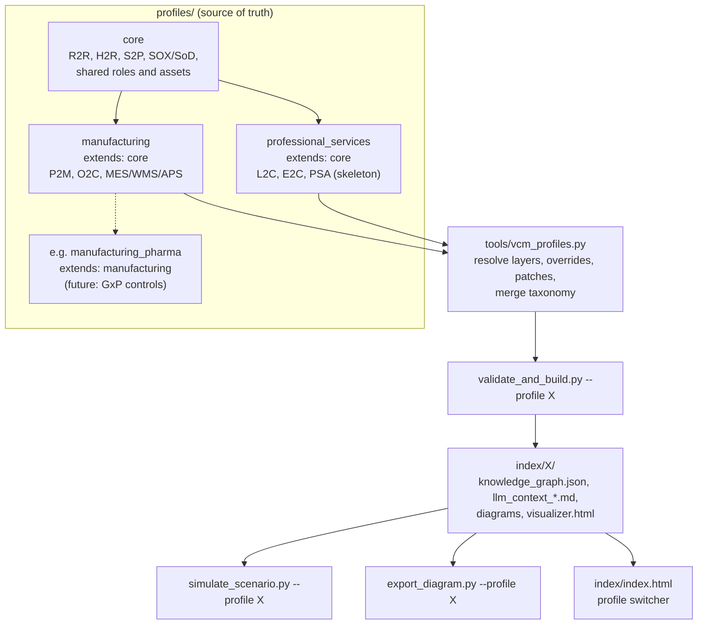

# Implementation Plan v2: Multi-Industry Profiles (Layered Core + Industry Overlays)

> **Revision note**: v1 moved every model folder into `profiles/manufacturing/` and added a `--profile` flag. That isolates industries, but it would make every industry keep its own copy of shared content, and it leaves several single-industry assumptions in the code. v2 keeps the `--profile` idea and adds the pieces needed to support **many** industries.

---

## Goal Description

Let the engine hold several industry operating models (Manufacturing, Professional Services, and later others such as Healthcare or Banking). Each industry has its own taxonomy, lifecycles, roles, assets, and scenarios. Users pick which model to build, visualize, and simulate with a single `--profile` flag. Content that every industry shares (R2R, H2R, generic S2P, SOX/SoD controls, finance and HR roles, ERP/HCM assets) is written **once** and inherited.

---

## Review of v1: Findings

| # | Gap in v1 | Evidence in the codebase | v2 Fix |
|:-:|:--|:--|:--|
| 1 | **Shared content gets duplicated** | R2R (5 steps), H2R (6), S2P (8), SOX/SoD policies, 13 roles, and 6 assets are not industry-specific. | **Core layer + overlays**: profiles declare `extends` |
| 2 | **A shared element already points into manufacturing** | `s2p_006_goods_services_receipt` → `p2m_004_manufacturing_execution`; `sod_spending_limits_policy` is tagged `O2C` | **Patches**: an overlay adds relations or lifecycle tags to an inherited element |
| 3 | **The ontology file is never used** | `ontology/taxonomies.json` is read by no tool. `lifecycles:` tags are free text. `type`/`relation` enums are copied into the schema. | Merge the taxonomy per profile, **enforce** it, and inject enums into the schemas at load time |
| 4 | **Exporter grouping is hardcoded** | `export_diagram.py` L174–183 groups by `s2p_001…004`, `o2c_`, `r2r_` prefixes. H2R and P2M already fall into "Other". | Add **`phases`** to lifecycle manifests and group from that data |
| 5 | **Generated outputs mixed in with source files** | v1 puts `index/` inside each profile | Write outputs to `index/<profile>/` and add a profile switcher page |
| 6 | **Build failures are silently ignored** | `os.system("python3 …")` in the validator (L267), exporter, and simulator ignores exit codes and skips `uv` | Use `subprocess.run(["uv","run",…], check=True)` and pass `--profile` along |
| 7 | **Tests change the real source tree** | `test_validator.py` writes into `elements/process_steps/` | Add a `--profiles-root` option and fixture profiles under `tests/fixtures/` |
| 8 | **No guard against accidental ID clashes** | With several layers, two files with the same `id` would silently replace each other | Replacing an inherited element requires an explicit **`overrides:`** declaration; otherwise the build fails |

---

## User Review Required

> [!WARNING]
> **Directory restructuring (breaking change for paths)**: `elements/`, `roles/`, `assets/`, `lifecycles/`, `ontology/`, and `simulations/` move under `profiles/core/` and `profiles/manufacturing/`. Generated files move from `index/` to `index/<profile>/`. Any external scripts or bookmarks that use the old paths will need updating.

> [!IMPORTANT]
> **Backward compatibility**: running a tool with no flag (`uv run tools/validate_and_build.py`) still builds `manufacturing`. The default comes from the `VCM_PROFILE` environment variable, falling back to `manufacturing`, so current workflows keep working.

---

## Open Questions

> [!IMPORTANT]
> **Q1 – Core layer vs. fully isolated profiles?** I recommend a shared core (this plan). The alternative is v1's full isolation: simpler code, but every industry keeps its own copy of R2R, H2R, and S2P.

> [!IMPORTANT]
> **Q2 – Where does O2C live?** O2C step `o2c_003` (inventory allocation, WMS) is product-specific, while credit, billing, and collections are generic. Recommendation: keep the **O2C lifecycle in `manufacturing`**, and move the customer, credit, and billing **roles** plus `asset_crm_system` to **core** so Professional Services can reuse them in `L2C`/`E2C`.

> [!IMPORTANT]
> **Q3 – Professional Services scope in this effort?** Recommendation: build the **profile skeleton only** (manifest, taxonomy with `L2C`/`E2C`, ADR-0007, empty folders). Write the actual E2C/L2C content as a separate roadmap phase.

> [!NOTE]
> **Q4 – Commit generated `index/` files?** They are committed today. With several profiles the diffs grow. Option: gitignore `index/` and let CI rebuild it. Default in this plan: **keep committing them** (no change in behavior).

---

## Target Architecture



### Directory layout

```
profiles/
├── core/
│   ├── profile.json
│   ├── ontology/taxonomies.json      # element/relation types, RACI/DACI, LOD, core lifecycles
│   ├── elements/ roles/ assets/ lifecycles/ simulations/
├── manufacturing/
│   ├── profile.json                  # extends: ["core"]
│   ├── ontology/taxonomies.json      # adds P2M, O2C
│   ├── elements/ roles/ assets/ lifecycles/ simulations/
│   └── patches/                      # appends to inherited elements
└── professional_services/            # skeleton
    ├── profile.json                  # extends: ["core"]
    └── ontology/taxonomies.json      # adds L2C, E2C
index/
├── index.html                        # profile switcher (generated)
├── manufacturing/ …                  # generated per profile
└── professional_services/ …
schema/  templates/  tools/  tests/   # unchanged location, global
```

### Layer resolution rules
1. **Order**: walk `extends` depth-first; later layers win. Inheritance cycles are a build error.
2. **New IDs** from any layer are added to the model.
3. **Same ID in two layers** is a build error, *unless* the later file declares `overrides: <layer_id>`. In that case it replaces the inherited element entirely.
4. **Patches** (`patches/*.yaml`) append to `graph_relations` and `lifecycles` of an inherited element. A patch whose target doesn't exist is a build error.
5. **Isolation guarantee**: `core` must build on its own (`--profile core`). This proves shared content never references industry-specific content.
6. **Provenance**: every node in `knowledge_graph.json` gets a `source_layer` field (`core`, `manufacturing`, …). LLM context packs and the visualizer show it.

---

## Proposed Changes

---

### Component 1: Profile Manifest & Schemas

#### [NEW] schema/profile_manifest.schema.json
```json
{
  "$schema": "http://json-schema.org/draft-07/schema#",
  "title": "ProfileManifest",
  "type": "object",
  "required": ["profile_id", "name", "version", "extends", "lifecycles"],
  "properties": {
    "profile_id": { "type": "string", "pattern": "^[a-z0-9_]+$" },
    "name": { "type": "string" },
    "industry": { "type": "string" },
    "version": { "type": "string", "pattern": "^[0-9]+\\.[0-9]+\\.[0-9]+$" },
    "description": { "type": "string" },
    "extends": { "type": "array", "items": { "type": "string" } },
    "lifecycles": { "type": "array", "items": { "type": "string" }, "minItems": 1 },
    "default_lifecycle": { "type": "string" },
    "apqc_pcf_variant": { "type": "string" }
  }
}
```

#### [NEW] profiles/manufacturing/profile.json
```json
{
  "profile_id": "manufacturing",
  "name": "Discrete Manufacturing",
  "industry": "manufacturing",
  "version": "1.0.0",
  "extends": ["core"],
  "lifecycles": ["S2P", "O2C", "R2R", "H2R", "P2M"],
  "default_lifecycle": "S2P",
  "apqc_pcf_variant": "cross-industry"
}
```
`profiles/core/profile.json` lists `["S2P","R2R","H2R"]` with `extends: []`. `profiles/professional_services/profile.json` lists `["S2P","R2R","H2R","L2C","E2C"]`.

#### [NEW] schema/profile_patch.schema.json
```yaml
# Example: profiles/manufacturing/patches/s2p_006_goods_services_receipt.yaml
target: s2p_006_goods_services_receipt
append:
  graph_relations:
    - relation: feeds_into
      target: p2m_004_manufacturing_execution
```
```yaml
# Example: profiles/manufacturing/patches/sod_spending_limits_policy.yaml
target: sod_spending_limits_policy
append:
  lifecycles: [O2C]
```

#### [MODIFY] value_chain_element.schema.json
- Add optional `overrides: { "type": "string" }`.
- Keep the `type` and `relation` enums as a fallback. At load time the validator **replaces** them with values from the merged taxonomy, so `taxonomies.json` becomes the single source of truth.

#### [MODIFY] lifecycle_manifest.schema.json
Add optional data-driven phases so diagrams stop depending on hardcoded ID prefixes:
```json
"phases": {
  "type": "array",
  "items": {
    "type": "object",
    "required": ["phase_id", "name", "milestones"],
    "properties": {
      "phase_id": { "type": "string" },
      "name": { "type": "string" },
      "milestones": { "type": "array", "items": { "type": "string" } }
    }
  }
}
```
`source_to_pay.json` gets two phases: `sourcing` (s2p_001–004) and `procure_to_pay` (s2p_005–008). Lifecycles without `phases` show as a single group named after the lifecycle.

#### [MODIFY] scenario_simulation.schema.json
Add optional `applicable_profiles: string[]`. Core scenarios (e.g., ERP outage) leave it empty, which means they can run under any profile that contains their targets.

---

### Component 2: Content Migration (core vs. manufacturing)

Moves are done with `git mv` so file history is kept. IDs and contents stay the same except where noted.

| Destination | Elements | Roles | Assets |
|:--|:--|:--|:--|
| **core** | `r2r_001–005`, `h2r_001–006`, `s2p_001–008`, `financial_close_reporting_stream`, `strategic_sourcing_stream`, `procure_to_pay_stream`, `sox_financial_reporting_controls_policy`, `sod_spending_limits_policy`, `data_journal_entry` | AP Clerk, Category Mgr, Compensation Analyst, Consolidation Specialist, Finance Controller, GL Accountant, Hiring Mgr, HRBP, Internal Auditor, Payroll Specialist, Procurement Specialist, Supplier, Talent Acquisition, *(Q2: Customer, Credit Mgr, Billing Specialist, Sales Ops)* | ERP, e-Procurement, Payment Gateway, Financial Consolidation, HCM, Payroll Engine, *(Q2: CRM)* |
| **manufacturing** | `p2m_001–006`, `o2c_001–005`, `order_fulfillment_stream`, `credit_limit_risk_policy`, `kpi_dso` | Demand Planner, Inventory Mgr, Mfg Supervisor, Production Scheduler, QA Engineer, Warehouse Supervisor | APS Planner, MES, WMS |

**Edits needed to keep core self-contained:**
- `s2p_006`: remove the `feeds_into p2m_004` relation and re-add it through a manufacturing patch.
- `sod_spending_limits_policy`: remove the `O2C` tag and re-add it through a manufacturing patch.

Scenarios: `scenario_erp_outage`, `scenario_close_period_crunch`, `scenario_controller_absence_surge`, `scenario_payroll_outage_surge`, `scenario_supplier_disruption`, and `scenario_invoice_bottleneck` go to **core**. `scenario_credit_hold_surge` and `scenario_raw_material_stockout` go to **manufacturing**.

---

### Component 3: Shared Profile Loader

#### [NEW] tools/vcm_profiles.py
A plain-stdlib module. `uv run tools/x.py` puts `tools/` on `sys.path`, so the three tools can `import vcm_profiles` directly.
```python
@dataclass
class EffectiveProfile:
    profile_id: str
    layers: list[str]                       # e.g. ["core", "manufacturing"]
    taxonomy: dict                          # merged lifecycles/types/relations
    element_files: dict[str, tuple[Path, str]]   # id -> (path, source_layer)
    role_files: dict[str, tuple[Path, str]]
    asset_files: dict[str, tuple[Path, str]]
    lifecycle_files: dict[str, tuple[Path, str]]
    scenario_files: dict[str, tuple[Path, str]]
    patches: list[dict]
    output_dir: Path                        # index/<profile_id>

def list_profiles(profiles_root: Path) -> list[dict]: ...
def resolve_profile(profiles_root: Path, profile_id: str, repo_root: Path) -> EffectiveProfile:
    """Depth-first extends resolution, override/collision checks, taxonomy merge."""
def default_profile() -> str:
    return os.environ.get("VCM_PROFILE", "manufacturing")
```

---

### Component 4: CLI Tools

Common arguments for all three tools: `--profile <id|ALL>` (default from `default_profile()`) and `--profiles-root <path>` (default `profiles/`, used by tests).

#### [MODIFY] tools/validate_and_build.py
- Resolve the effective profile, apply patches to the parsed frontmatter, then validate.
- **New checks**: each element's `lifecycles` tags must appear in the profile taxonomy; relation and element types come from the taxonomy; collisions need `overrides:`; patch targets must exist; `extends` must have no cycles; `profile.lifecycles` must each have a manifest.
- Add `source_layer` to every graph node and to LLM context pack headers.
- Write output to `index/<profile>/`. `--profile ALL` builds every profile (except `core`, unless asked for explicitly), then writes `index/index.html`.
- `--list-profiles` prints the available profiles with their inheritance chains.
- Replace `os.system("python3 …")` with `subprocess.run(["uv","run",exporter,"--profile",p,…], check=True)`.

#### [MODIFY] tools/export_diagram.py
- `load_data(repo_root, profile)` reads `index/<profile>/knowledge_graph.json`.
- Replace the hardcoded prefix buckets (L157–235) with grouping by `lifecycle.phases`. Unphased lifecycles fall back to one group each, so H2R, P2M, L2C, and E2C each get their own labeled group.
- The visualizer header shows the active profile and links back to `index/index.html`.
- The `--lifecycle` default becomes the profile's `default_lifecycle`.

#### [MODIFY] tools/simulate_scenario.py
- Switch to `argparse`: `simulate_scenario.py [--profile X] <scenario>`. `<scenario>` can be a path or a bare `scenario_id`, which is looked up across the profile's layers.
- Fail clearly if `applicable_profiles` excludes the active profile, or if a shock target isn't in the profile.
- The fallback build calls `uv run validate_and_build.py --profile X` and checks the exit code.
- Write reports to `index/<profile>/`.

#### [NEW] tools/new_profile.py
Scaffolder: `uv run tools/new_profile.py healthcare --extends core --name "Healthcare Provider"` creates the manifest, taxonomy stub, empty folders, and an ADR stub from `templates/`. This makes adding the next industry a single command.

---

### Component 5: Professional Services Skeleton (scope per Q3)

#### [NEW] profiles/professional_services/profile.json, ontology/taxonomies.json
Taxonomy adds `L2C` (Lead to Contract, Business Development) and `E2C` (Engagement to Cash, Service Delivery & Billing).
#### [NEW] docs/decisions/0007-industry-profiles-architecture.md
Records the layering, override, and patch rules and the core/manufacturing split.
#### [NEW] docs/decisions/0008-professional-services-taxonomy.md (draft)
Lifecycle boundaries for L2C/E2C. Required before any content is written (per the "ADR first" standard).

---

### Component 6: Tests

#### [NEW] tests/fixtures/profiles/{base,child,bad_*}/
Small fixture profiles so negative tests never touch real content.

#### [MODIFY] tests/test_validator.py
- Parametrize the success test over every real profile (`core`, `manufacturing`, `professional_services`).
- Move the SoD and schema negative tests to fixtures via `--profiles-root`.
- **New negative tests**: undeclared ID collision; patch with a missing target; `extends` cycle; unknown lifecycle tag; core element referencing an overlay element.

#### [NEW] tests/test_profiles.py
- Inheritance order and override behavior.
- **Isolation**: the `professional_services` knowledge graph contains no `p2m_*`/`o2c_*` nodes.
- **Provenance**: `r2r_001` has `source_layer == "core"` in the manufacturing graph.

#### [MODIFY] tests/test_simulation.py, tests/test_exporter.py
Point them at `index/manufacturing/`. Add a test that runs core scenario `scenario_erp_outage` under **both** profiles.

---

### Component 7: CI, Docs, Roadmap

- **[MODIFY] `.github/workflows/ci.yml`**: `uv run tools/validate_and_build.py --profile ALL`, plus `--profile core` to enforce the isolation guarantee.
- **[MODIFY] `GEMINI.md`, `README.md`, `docs/reference/cli-tooling-reference.md`, `docs/guides/authoring-elements-and-lifecycles.md`**: new directory tree, `--profile` usage, and a section on when to put content in core vs. an overlay vs. a patch.
- **[MODIFY] `ROADMAP.md`**: insert **Phase 8.5: Industry Profiles (v1.8.0)** before the API, add **Phase 8.6: Professional Services Content**, and make Phase 9 endpoints profile-scoped (`/api/v1/profiles/{profile}/graph`).

---

## Execution Order (staged, each stage committed separately)

| Stage | Scope | Exit Gate |
|:-:|:--|:--|
| **A** | Loader, profile manifests, core/manufacturing split, patches, `index/<profile>/` output | **Regression equality**: the normalized manufacturing `knowledge_graph.json` matches the pre-migration snapshot (ignoring `source_layer` and key order) |
| **B** | Taxonomy enforcement, dynamic enums, `phases`-driven exporter, provenance, profile switcher, subprocess fixes | All tests pass. H2R and P2M render in their own groups instead of "Other". |
| **C** | Professional Services skeleton, `new_profile.py`, ADR-0007/0008 | `--profile professional_services` and `--profile core` both build cleanly |
| **D** | Test fixtures and new tests, CI matrix, docs, roadmap | Full `pytest` passes; CI workflow updated |

---

## Verification Plan

### Automated Tests
```bash
# 0. Before any change: snapshot the current graph
cp index/knowledge_graph.json <artifact_dir>/scratch/kg_baseline.json

# 1. Build every profile, plus core on its own (isolation guarantee)
uv run tools/validate_and_build.py --profile ALL
uv run tools/validate_and_build.py --profile core

# 2. Regression equality for manufacturing (Stage A gate)
uv run <artifact_dir>/scratch/compare_kg.py <artifact_dir>/scratch/kg_baseline.json index/manufacturing/knowledge_graph.json

# 3. Same core scenario under two industries
uv run tools/simulate_scenario.py --profile manufacturing scenario_erp_outage
uv run tools/simulate_scenario.py --profile professional_services scenario_erp_outage

# 4. Full test suite
uv run --with pytest pytest tests/ -v
```

### Manual Verification
- Open `index/index.html`, switch between profiles, and confirm that each visualizer shows only that profile's lifecycles and that the profile badge is correct.
- In `index/manufacturing/value_chain_visualizer.html`, confirm H2R and P2M now have their own labeled groups.
- Read `index/manufacturing/llm_context_r2r.md` and confirm the provenance shows `core`.
